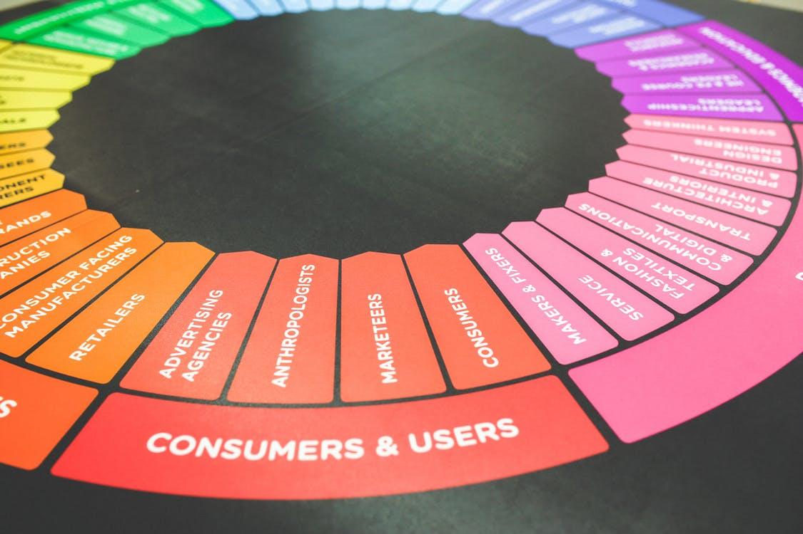
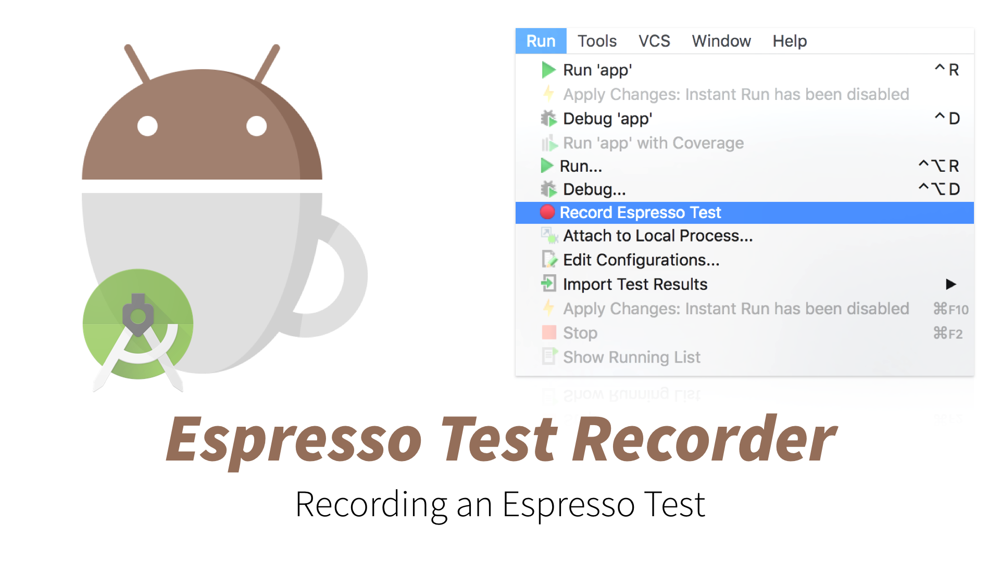
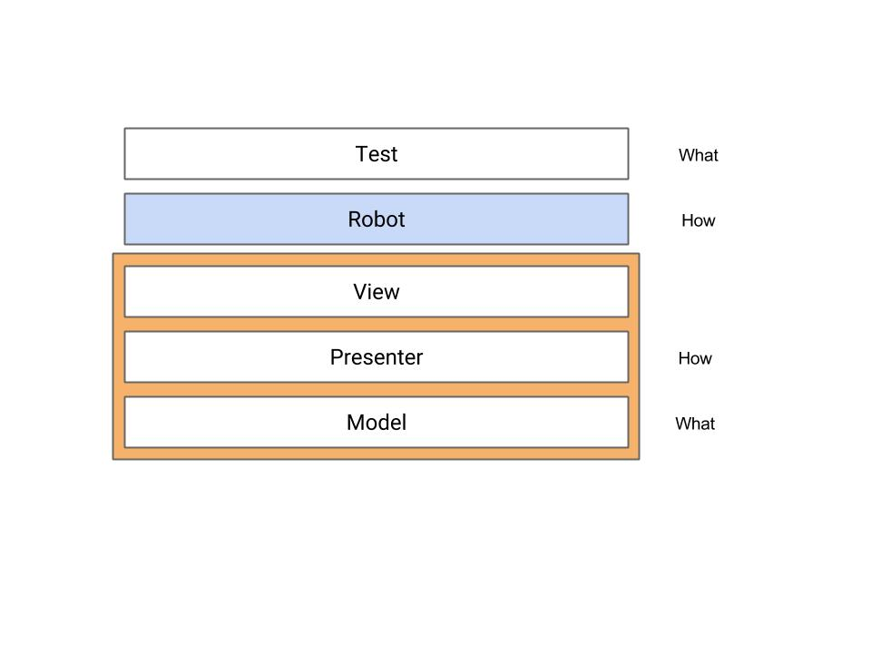
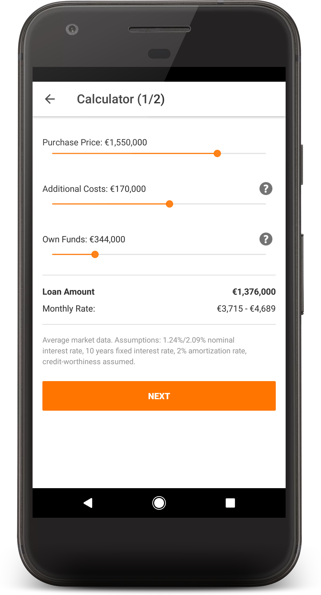

footer: ### ashdavies.io


# Kotlin Test Robots

^ Following the announcement at this years Google IO we've seen a dramatic uptake in Kotlin and over the last few months we've learnt how we can use it to improve and produce clean architecture applications and supercharge our unit tests, but what about our UI tests?

^ In this session, I'll show you how you can utilise Kotlin with the Robot pattern to build concise, terse and easy to read UI tests

---


# Testing

^ Why do we test?
- Allows us to understand our code
- Find bugs and verify behaviour
- To give assurance about our app
- Allow us to refactor safely
- Working effectively with legacy code

---


# Tooling

^ How can we test?
- QA teams
- Smoke tests
- Manual tests
- Unit testing
- UI testing

---


^ Unit tests pass, no integration tests

---



# UI Testing

^ 
- UI tests tests everything as a cohesive interface
- Verifies integrated behaviour
- Defines the extent of implementation
- Create high level acceptance tests

---


# Architecture Agnostic

^
- UI tests test your application without concern for architecture.
- It doesn't matter if you use MVP or MVVM
- The user only sees the screen and how it reacts to input.

---


# Espresso

^
- Who has written an espresso test?
- Who enjoyed writing that test?

---



^ Last year Google released the espresso test recorder
^ But the generated code isn't so readable

---

```java
ViewInteraction appCompatEditText = onView(
        allOf(withId(R.id.email),
                withParent(allOf(withId(R.id.activity_main),
                        withParent(withId(android.R.id.content)))),
                isDisplayed()));
appCompatEditText.perform(click());

ViewInteraction appCompatEditText2 = onView(
        allOf(withId(R.id.email),
                withParent(allOf(withId(R.id.activity_main),
                        withParent(withId(android.R.id.content)))),
                isDisplayed()));
appCompatEditText2.perform(replaceText("test@invalid"), closeSoftKeyboard());

ViewInteraction appCompatButton = onView(
        allOf(withId(R.id.validate_button), withText("Validate"),
                withParent(allOf(withId(R.id.activity_main),
                        withParent(withId(android.R.id.content)))),
                isDisplayed()));
appCompatButton.perform(click());

ViewInteraction textView = onView(
        allOf(withId(R.id.validation_result), withText("Invalid Email Format"),
                childAtPosition(
                        allOf(withId(R.id.activity_main),
                                childAtPosition(
                                        withId(android.R.id.content),
                                        0)),
                        1),
                isDisplayed()));
textView.check(matches(isDisplayed()));
```

---


"I've calculated your chance of survival, 
but I don't think you'll like it." 
-- Marvin

^ Espresso tests are hard to write, hard to read, and hard to debug
^ Espresso Test Recorder introduced to help but the code created is awful to read 

---


# Espresso

^ What does an Espresso test look like?

---

# Espresso

```kotlin
@Test
fun shouldValidateEmailAddress() {
    onView(withId(R.id.email)).check(matches(isDisplayed()))
    onView(withId(R.id.email)).perform(typeText("ash"))

    onView(withId(R.id.login)).perform(click())
    onView(withId(R.id.error)).check(matches(allOf(isDisplayed(), withText(R.string.invalid_email))))
}
```

^ Espresso Testing
- Powerfull framework to build test assertions
- Still referencing how the view is implemented
- Tight coupling with the view implementation

---

# Espresso

```kotlin
@Test
fun `should validate email address`() {
    onView(withId(R.id.email)).check(matches(isDisplayed()))
    onView(withId(R.id.email)).perform(typeText("ash"))

    onView(withId(R.id.login)).perform(click())
    onView(withId(R.id.error)).check(matches(allOf(isDisplayed(), withText(R.string.invalid_email))))
}
```

^ You can immediately improve the readability here with human readable test name
- But we can still notice something quite wrong about this format

---


^ What, and how combined in the test
- If the view implementation changes, then we have to update the tests

---

# Robots


^ Robots
- The Robot pattern allows us to encode "the how"
- Allows you to create stable, readable and maintainable tests
- Abstract it away from the test behaviour concerned with "the what"

---



^ By abstracting the how into a separated robot we encapsulate it from the why
- If your view implementation changes, then you only have to update the robot
- Now our tests are only concerned with business logic

---

# Robots

- Structure your own domain language

^ The beauty of using the Robot pattern, means that you can define your own domain language that makes sense for you.

---

# Robots

- Structure your own domain language
- Contextualise assertions and verifications

^ You can identify context scopes that allow you to make assertions or verifications at a point in time that is logical.

---

# Robots

- Structure your own domain language
- Contextualise assertions and verifications
- High level intention language

^ We can take these high level intention and encapsulate them within this robot so our test api is terse and readable.

---

# Robots

- Structure your own domain language
- Contextualise assertions and verifications
- High level intention language
- Reads like a script

^ This allows the test to read as though it was a declarative QA testing script.

---


# Sound Familiar?
### Testing Robots (Kotlin Night) - JW

^
- Jake demonstrates how we can chain operations from a build of preconditions and verifications
- This works really well for simple interfaces, but what if you have a complex hierarchy or repeated list of views?
- You can continue to nest and build your context scopes as you see fit
- The rest is how you can actually take this information and apply it

---


^ Kotlin
- Already seen plenty of talks on how to use Kotlin in unit tests
- Lets begin with an example for a real estate financing app

---



---

# Robot

```kotlin
class FinanceRobot {

    fun price(amount: Int): FinanceRobot { ... }

    fun costs(amount: Int): FinanceRobot { ... }

    fun funds(amount: Int): FinanceRobot { ... }

    fun next(): ResultRobot { ... }
}
```

^ This is what a robot might look like for this screen

---

# Robots

```kotlin, [.highlight: 4, 8, 12, 16]
class FinanceRobot {
    
    fun price(amount: Int) = apply {
        onChild(withId(R.id.price)).perform(typeText(value))
    }

    fun costs(amount: Int) = apply {
        onChild(withId(R.id.costs)).perform(typeText(value))
    }

    fun funds(amount: Int) = apply {
        onChild(withId(R.id.funds)).perform(typeText(value))
    }

    fun next() = apply {
        onChild(withId(R.id.next)).perform(click())
    }
}
```

^ These methods may contain simple view actions
- You can use a simple apply block to return the robot object

---

```kotlin
class FinanceTest {

    fun `should update seek bar amount`() {
        FinanceRobot()
            .price(200_000)
            .next()
    }
}
```

^ And the resulting test would look like this
- Given the scenario that the user can also enter a numeric input
- The progress should be reflected in the seek bar
- You may notice there's no verification here

---

# Cucumber
## Gherkin

```gherkin
 Feature: Some terse yet descriptive text of what is desired
    Textual description of the business value of this feature
    Business rules that govern the scope of the feature
    Any additional information that will make the feature easier to understand
 
    Scenario: Some determinable business situation
        Given some precondition
            And some other precondition
        When some action by the actor
            And some other action
            And yet another action
        Then some testable outcome is achieved
            And something else we can check happens too
```

---

# Kotlin

```kotlin
@Test
fun `should update progress bar amount`() {
    FinanceRobot()
        .given { amount(200_000) } 
        .then { progress(200_000) }
}
```

^ I wrote the tests in a syntax that I thought readable
- You can achieve this syntax by encapsulating an extension function
- This allows you to contextualise the operations you wish to perform

---

# Kotlin

```kotlin
class FinanceRobot {

    fun given(func: Given.() -> Unit) = Given().apply(func)

    class Given {

        fun amount(value: Int) = apply { 
            onChild(withId(R.id.input)).perform(typeText(value))
        }
    }
}
```

^ This syntax allows you nest operations within functions

---

# Kotlin

```kotlin, [.highlight: 3, 7-9]
class FinanceRobot {

    fun given(func: Given.() -> Unit) = Given().apply(func)

    class Given {

        fun amount(value: Int) = apply { 
            onChild(withId(R.id.input)).perform(typeText(value))
        }
    }
}
```

^ This creates a new given object and applies the function
- Allowing us to then chain an assertion syntax "amount"

---

# Kotlin

```kotlin, [.highlight: 12-19]
class FinanceRobot {

    fun given(func: Given.() -> Unit) = Given().apply(func)

    class Given {

        fun amount(value: Int) = apply { 
            onChild(withId(R.id.input)).perform(typeText(value))
        }
    }

    fun then(func: Then.() -> Unit) = Then().apply(func)

    class Then {

        fun progress(value: Int) = apply {
            onChild(withId(R.id.progress)).perform(scrubProgress(value))
        }
    }
}
```

^ Here we nest the assertion syntax away from the precondition

---

# IntentsTestRule

```kotlin
@get:Rule
val rule: IntentsTestRule<FinanceActivity> = FinanceRobot.rule()
```

^ IntentsTestRule
- Most samples show immediate activity start
- No change to provide intent parameters

---

# Activity Starter

```kotlin
class FinanceActivity : AppCompatActivity {

    companion object {
        
        fun start(context: Context, amount: Int) { ... }
    }
}
```

^ Here we use a statically accessible activity starter to encapsulate parameter serialisation

---

# Activity Starter
## Exposed Intent

```kotlin
class FinanceActivity : AppCompatActivity {

    companion object {

        fun start(context: Context, amount: Int) = context.startActivity(newIntent(amount))

        @VisibleForTesting
        fun newIntent(amount: Int) { ... }
    }
}
```

---

# Intent Captor

```kotlin
inline fun start(rule: IntentsTestRule<T>, starter: (Context) -> Unit) {
    val context = mock<Context>()
    starter(context)

    val captor = argumentCaptor<Intent>()
    then(context).should().startActivity(captor.capture())

    captor.lastValue.apply {
      component = ComponentName(InstrumentationRegistry.context, component.className)
      rule.launchActivity(this)
    }
}
```

---

# Intent Captor

```kotlin, [.highlight: 2-3]
inline fun start(rule: IntentsTestRule<T>, starter: (Context) -> Unit) {
    val context = mock<Context>()
    starter(context)

    val captor = argumentCaptor<Intent>()
    then(context).should().startActivity(captor.capture())

    captor.lastValue.apply {
      component = ComponentName(InstrumentationRegistry.context, component.className)
      rule.launchActivity(this)
    }
}
```

^ Creates mock context and invokes the starter extension function

---

# Intent Captor

```kotlin, [.highlight: 5-6]
inline fun start(rule: IntentsTestRule<T>, starter: (Context) -> Unit) {
    val context = mock<Context>()
    starter(context)

    val captor = argumentCaptor<Intent>()
    then(context).should().startActivity(captor.capture())

    captor.lastValue.apply {
      component = ComponentName(InstrumentationRegistry.context, component.className)
      rule.launchActivity(this)
    }
}
```

^ Captures the intent parameter via mocked context

---

# Intent Captor

```kotlin, [.highlight: 8-11]
inline fun start(rule: IntentsTestRule<T>, starter: (Context) -> Unit) {
    val context = mock<Context>()
    starter(context)

    val captor = argumentCaptor<Intent>()
    then(context).should().startActivity(captor.capture())

    captor.lastValue.apply {
      component = ComponentName(InstrumentationRegistry.context, component.className)
      rule.launchActivity(this)
    }
}
```

^ Corrects intent context and launches via provided rule

---


# Robot Companion

---

# Robot Companion

```kotlin, [.highlight: 1,15]
abstract class RobotCompanion<T : Activity> {

    inline fun start(rule: IntentsTestRule<T>, starter: (Context) -> Unit) {
        val context = mock<Context>()
        starter(context)

        val captor = argumentCaptor<Intent>()
        then(context).should().startActivity(captor.capture())

        captor.lastValue.apply {
        component = ComponentName(InstrumentationRegistry.context, component.className)
        rule.launchActivity(this)
        }
    }
}
```

---

# Robot Companion

```kotlin
class FinanceRobot {

    companion object : RobotCompanion<FinanceActivity>() {

        fun start(rule: IntentsTestRule<FinanceActivity>, amount: Int = 200_000): FinanceRobot {
            start(rule, { context -> FinanceActivity.start(context, amount) })
            return FinanceRobot()
        }
    }
}
```

^ Starter
- Default parameters for easy activity starting
- Calls starter from activity companion

---

# Testing Robots

```kotlin
FinanceRobot.start(rule)
    given { input "200000" }
    then { equals "20.000 €" }
```

---

# Testing Robots

```kotlin
FinanceRobot.start(rule)
    given { 
        price { input "200000" }
        funds { scrub 40_000 }
    }
    then {
        price { equals "200.000 €" }
        funds { equals "40.000 € / 20 %" }
    }
```

---

# Thanks

^ Topics
- Utilising Kotlin extension functions on "context" objects to provide assertions and verifications
- Splitting sequence of your operation into class contexts

^ Resources 
- https://academy.realm.io/posts/kau-jake-wharton-testing-robots/