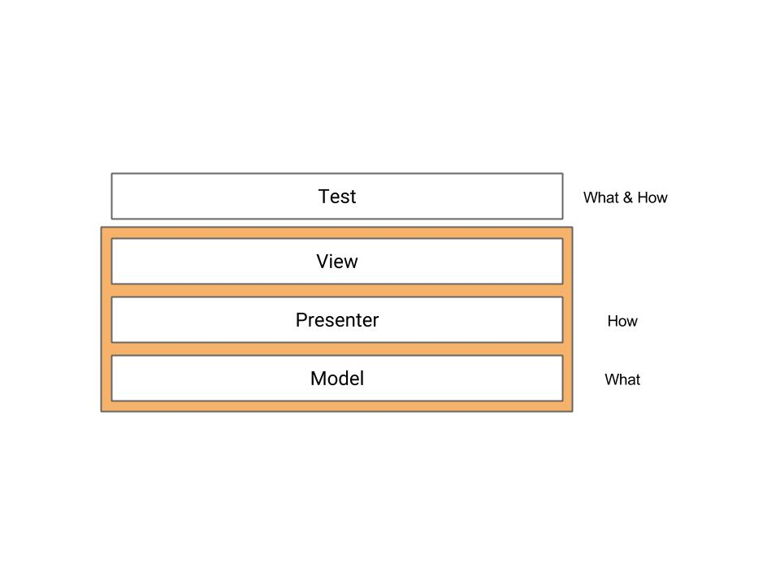

footer: ### ashdavies


# Kotlin Test Robots

^ Following the announcement at this years Google IO we've seen a dramatic uptake in Kotlin and over the last few months we've learnt how we can use it to improve and produce clean architecture applications and supercharge our unit tests, but what about our UI tests?

^ In this session, I'll show you how you can utilise Kotlin with the Robot pattern to build concise, terse and easy to read UI tests

---


# Testing

^ Why do we test?
- Find bugs and verify behaviour
- To give assurance about our app
- Allow us to refactor safely

---


# Tooling

^ How can we test?
- Manual tests
- Unit testing
- UI testing

---


# UI Testing

^ 
- UI tests tests everything as a cohesive interface
- Defines the extent of implementation
- Create high level acceptance tests

---


# Architecture Agnostic

^
- UI tests test your application without concern for architecture.
- It doesn't matter if you use MVP or MVVM
- The user only sees the screen and how it reacts to input.

---


# Espresso

^
- Who has written an espresso test?
- Who enjoyed writing that test?

---


"I've calculated your chance of survival, 
but I don't think you'll like it." 
-- Marvin

^ Espresso tests are hard to write, hard to read, and hard to debug
^ Espresso Test Recorder introduced to help but the code created is awful to read 

---


# Espresso

^ What does an Espresso test look like?

---

# Espresso

```kotlin
@Test
fun shouldRoundToInterval() {
    onView(withId(R.id.email)).check(matches(isDisplayed()))
    onView(withId(R.id.email)).perform(typeText("ash"))

    onView(withId(R.id.login)).perform(click())
    onView(withId(R.id.error)).check(matches(allOf(isDisplayed(), withText(R.string.invalid_email))))
}
```

^ Espresso Testing
- Powerfull framework to build test assertions
- Still referencing how the view is implemented
- Tight coupling with the view implementation

---

# What ... how ... now?



^ If the view implementation changes, then we have to update the tests

---

# Robots


^ Robots
- The Robot pattern allows us to encode "the how"
- Allows you to create stable, readable and maintainable tests
- Abstract it away from the test behaviour concerned with "the what"
- If your view implementation changes, then you only have to update the robot

---

# Robots

- Structure your own domain language

^ The beauty of using the Robot pattern, means that you can define your own domain language that makes sense for you.

---

# Robots

- Structure your own domain language
- Contextualise assertions and verifications

^ You can identify context scopes that allow you to make assertions or verifications at a point in time that is logical.

---

# Robots

- Structure your own domain language
- Contextualise assertions and verifications
- High level intention language

^ We can take these high level intention and encapsulate them within this robot so our test api is terse and readable.

---

# Robots

- Structure your own domain language
- Contextualise assertions and verifications
- High level intention language
- Reads like a script

^ This allows the test to read as though it was a declarative QA testing script.

---


# Familiar?
### Testing Robots (Kotlin Night) - JW

^
- Jake demonstrates how we can chain operations from a build of preconditions and verifications
- This works really well for simple interfaces, but what if you have a complex hierarchy or repeated list of views?
- You can continue to nest and build your context scopes as you see fit
- The rest is how you can actually take this information and apply it

---


^ Kotlin
- Already seen plenty of talks on how to use Kotlin in unit tests
- Lets begin with an example for a real estate financing app

---

# Kotlin

```kotlin
financing()
    given { amount "200000" } 
    then { amount "2.000.000 €" }
```

^ I wrote the tests in a syntax that I thought readable
^ Then made it work using Kotlin

---

# IntentsTestRule

```kotlin
@get:Rule
val rule: IntentsTestRule<FinanceCalculatorActivity> = FinanceCalculatorRobot.rule()
```

^ IntentsTestRule
- Most samples show immediate activity start
- No change to provide intent parameters

---

# Activity Starter

```kotlin
class Activity : AppCompatActivity {

    companion object {
        
        fun start(context: Context, parameter: Int) { ... }
    }
}
```

^ Here we use a statically accessible activity starter to encapsulate parameter serialisation

---

# Activity Starter
## Exposed Intent

```kotlin
class Activity : AppCompatActivity {

    companion object {

        fun start(context: Context, parameter: Int) = context.startActivity(newIntent(parameter))

        @VisibleForTesting
        fun newIntent(parameter: Int) { ... }
    }
}
```

---

# Intent Captor

```kotlin
inline fun start(rule: IntentsTestRule<T>, starter: (Context) -> Unit) {
    val context = mock<Context>()
    starter(context)

    val captor = argumentCaptor<Intent>()
    then(context).should().startActivity(captor.capture())

    captor.lastValue.apply {
      component = ComponentName(InstrumentationRegistry.context, component.className)
      rule.launchActivity(this)
    }
}
```

---

# Intent Captor

```kotlin, [.highlight: 2-3]
inline fun start(rule: IntentsTestRule<T>, starter: (Context) -> Unit) {
    val context = mock<Context>()
    starter(context)

    val captor = argumentCaptor<Intent>()
    then(context).should().startActivity(captor.capture())

    captor.lastValue.apply {
      component = ComponentName(InstrumentationRegistry.context, component.className)
      rule.launchActivity(this)
    }
}
```

^ Creates mock context and invokes the starter extension function

---

# Intent Captor

```kotlin, [.highlight: 5-6]
inline fun start(rule: IntentsTestRule<T>, starter: (Context) -> Unit) {
    val context = mock<Context>()
    starter(context)

    val captor = argumentCaptor<Intent>()
    then(context).should().startActivity(captor.capture())

    captor.lastValue.apply {
      component = ComponentName(InstrumentationRegistry.context, component.className)
      rule.launchActivity(this)
    }
}
```

^ Captures the intent parameter via mocked context

---

# Intent Captor

```kotlin, [.highlight: 8-11]
inline fun start(rule: IntentsTestRule<T>, starter: (Context) -> Unit) {
    val context = mock<Context>()
    starter(context)

    val captor = argumentCaptor<Intent>()
    then(context).should().startActivity(captor.capture())

    captor.lastValue.apply {
      component = ComponentName(InstrumentationRegistry.context, component.className)
      rule.launchActivity(this)
    }
}
```

^ Corrects intent context and launches via provided rule

---

# Cucumber
## Gherkin

```gherkin
 Feature: Some terse yet descriptive text of what is desired
    Textual description of the business value of this feature
    Business rules that govern the scope of the feature
    Any additional information that will make the feature easier to understand
 
    Scenario: Some determinable business situation
        Given some precondition
            And some other precondition
        When some action by the actor
            And some other action
            And yet another action
        Then some testable outcome is achieved
            And something else we can check happens too
```

---

# BDD Testing
### Given ... When ... Then

---

# BDDMockito

```java
public class BDDMockito extends Mockito {

    public static <T> BDDMyOngoingStubbing<T> given(T methodCall) { ... }

    public static <T> Then<T> then(T mock) { ... }

    public static BDDStubber willThrow(Throwable... toBeThrown) { ... }

    public static BDDStubber willAnswer(Answer<?> answer) { ... }

    public static BDDStubber willDoNothing() { ... }

    public static BDDStubber willCallRealMethod() { ... }
}
```

---

^ Topics
- Starting your activity using an `IntentsTestRule` and `RobotCompanion`
- Alias start invocation with extension function and default parameters `rule.start(price = 50_000)`
- Utilising Kotlin extension functions on "context" objects to provide assertions and verifications
- Splitting sequence of your operation into class contexts

^ Additional
- Unit tests! (Show unit v integration test meme)

^ Resources 
- https://academy.realm.io/posts/kau-jake-wharton-testing-robots/