footer: 
autoscale: true
build-lists: true
header: Roboto
text: Roboto
theme: Next

[.footer: ashdavies.io - @askashdavies]


[.header-strong: #e7dc6f]
[.header: #ffffff]

## **Preparing your app for Google Play Instant**

### Droidcon London 2018 

 

^ Speaker introduction

^ Freebies for questions

---


^ Mobile economy driven by apps

^ Mobile development business priority

---


^ Mobile first business strategy often employed, spend time on promotion

^ Resulting in, growth (acquisition), user retention statistics used as measurement of success

---

[.background-color: #ffffff]


^ Wherever the user journey starts, often using a URL

^ Referral, word-of-mouth, advertisement, social, Google

^ It inevitably ends up on Google Play to install

---

# 💪

^ Incredibly useful tool, reliable distribution

^ Guaranteed safety, Google Play Protect

^ Brand identity, source of truth, trust

---

# 🧗 Friction 

^ One more step to your awesome user experience

---


^ This graceful feline had no friction,

^ but perhaps needed some.

---


^ How often have you seen this when trying to install?

^ Long installation times one of the leading cause of cancellation

^ User acquisition funnel already difficult

---

# 😡

---

# `< />`

^ Progressive web apps (mobile optimised sites)

^ Often clunky, unintuitive, require extensive dev time

^ Not as pleasant as a native mobile experience

---

[.background-color: #ffffff]


^ Instant apps are native apps that don't require an installation

^ Ideal for businesses with an existing Android app

^ From a URL, Google Play installs minimised version and runs

---

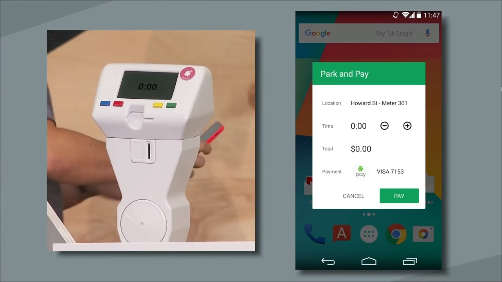

^ Introduces as instant apps 2016, NFC concept with "Park and Pay"

^ SDK opened up next year for users running Lollipop or later

---

# `<a href />`

^ Two flavours of instant app 

^ One registered to a url

---

# Try Now

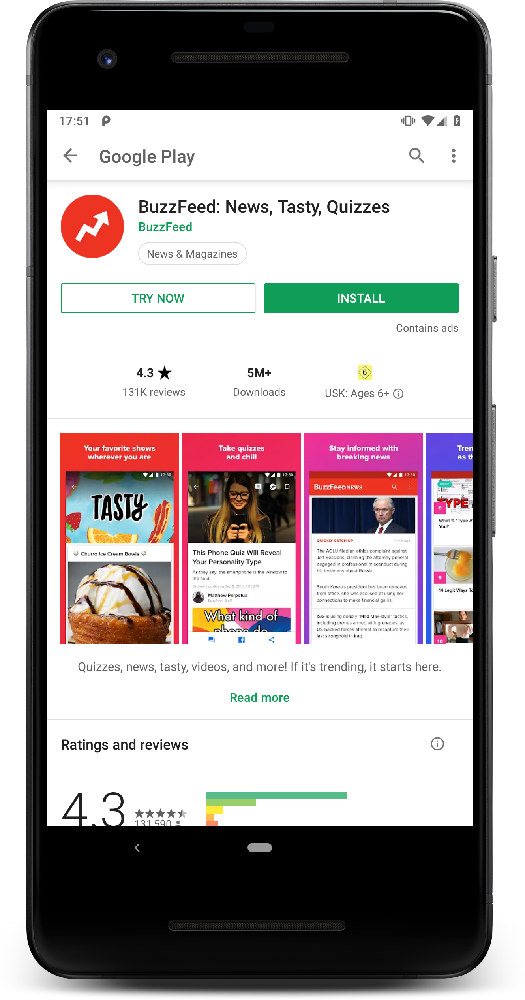

^ Try now button for installed apps

---

# <br />

## Performance


^ Doesn't automatically improve performance

^ Encourages you to modularise from a single artifact

^ Instant apps, are by nature "instant"

^ AGP includes clever optimisations, incremental builds, parrallelisation

---

[.background-color: #ffffff]
[.header: #333333]

# <br />

## Security


^ When executing native code automatically from a URL

^ Concern for instant security implications

^ Careful precautions have been taken

---

## 🔐 HTTPS

^ All network traffic must be secure

^ Do this anyway!

---

[.background-color: #478ff9]

## Smart Lock


^ Smart lock for passwords on Android

^ Retrieve previously stored credentials from Credentials API 

^ Apps linked by verified URL in Play Developer Console

^ Requires explicit user permission

---
 
## 💳 Play Billing Library

^ Payments offered though Google Play Billing Library

^ Fast and easy payments in over 135 countries

^ Google Pay for physical goods

---
 
## Runtime Permissions

^ Must use runtime permissions introduced in Marshmallow

^ Intercepted for Lollipop

---

- `ACCESS_COARSE_LOCATION`
- `ACCESS_FINE_LOCATION`
- `ACCESS_NETWORK_STATE`
- `BILLING` (Deprecated as of Play Billing Library 1.0)
- `CAMERA`
- `INSTANT_APP_FOREGROUND_SERVICE` (Only in Android Oreo)
- `INTERNET`
- `READ_PHONE_NUMBERS` (Only in Android Oreo)
- `RECORD_AUDIO`
- `VIBRATE`

^ Limited to supported permissions

---

# Limitations

^ To abide by security and performance, limitations observed

---

# ₿ ⛏️ 💰

^ Mine Bitcoin in the background without users consent?

---

## ~~Background Services~~

^ No dice, background services are disabled!

---

## ~~Push Notifications~~

^ Like background services, no background notifications

^ Beta program available by application

---

## ~~External Storage~~

^ No access to external storage, shared photos and media

^ Cannot detect installed apps

---

## 🎉 Local Storage 

^ Don't worry! Still have access to local storage

^ Internal cache, internal storage, shared preferences

^ SqlLiteDatabase and content providers, but not exported

---

## Instant <-> Installed

^ Instant apps great for user acquisition and growth

^ Promote installed app, tease user with features

^ But you want to offer a seamless experience

---

## Cookie API


^ Great news! Use cookies just like on the web

^ Available to installed and instant apps

^ Help migrate users over to installed app

^ Used with PackageManager (or SupportPackageManager) API

---

[.background-color: #FFFFFF]
[.header: #666666]

## Size Limit (4 Mb)

 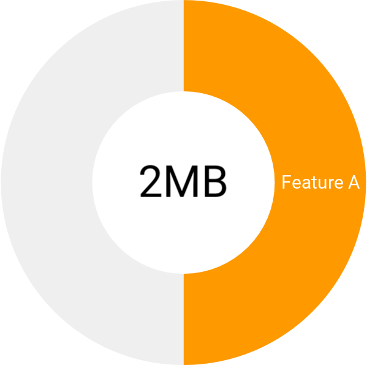 

^ Instant Apps should be instant, small as possible

^ Arbitrary size limit imposed for fast download

---

[.background-color: #FFFFFF]
[.header: #666666]

## Size Limit ~~(4 Mb)~~ (10 Mb) 💪

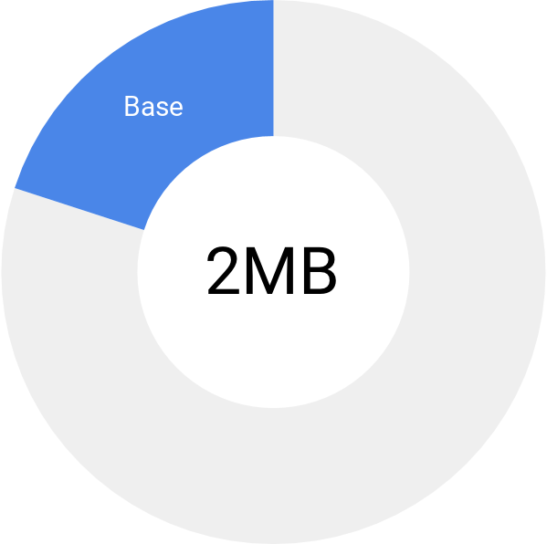 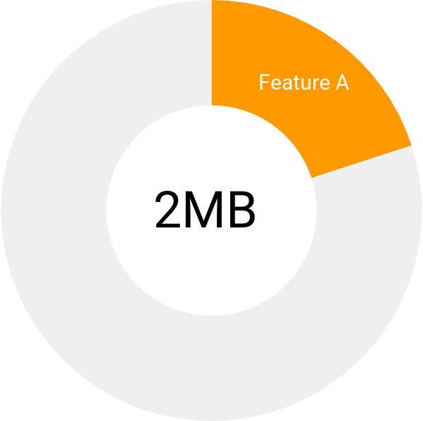 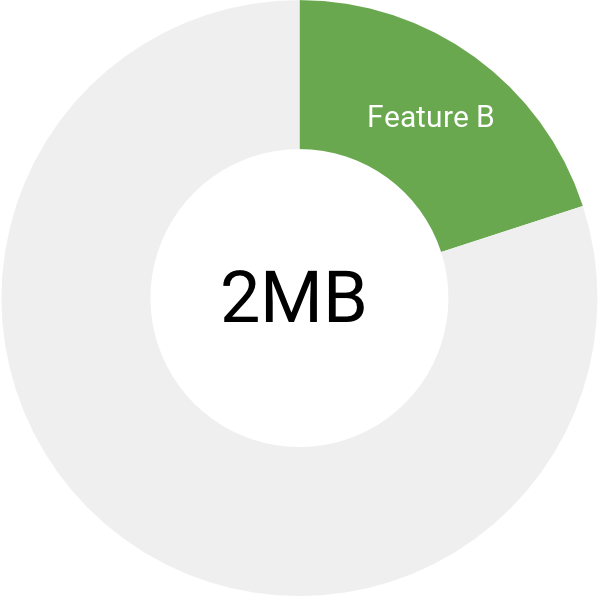

^ After Google Playtime event,
 
^ Size increased to 10 Mb

^ Should still keep small

---

[.background-color: #000000]


^ Talk on *preparing* your app, useful to give example case study

^ Need to give a bit of our app history

---

[.footer: ]


^ Started at Scout just over two years ago

^ Joined financing teams, connecting users with mortgage providers

^ Low interest, high costs, need to offer best deal

^ Dream of digitising entire moving process

--- 

# The Monolith


^ Not only back ends work with a monolith

^ Two modules app and search (java only)

^ Lighter module contained interface contracts

^ Larger module, implementations, *everything* else

^ Tight feature coupling

---

# Location Input

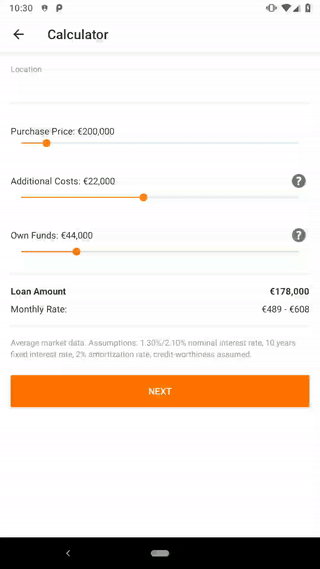

^ Early initiative, offer financing location input

^ Reused search funnel location searching, makes sense?

^ Quickly grew out of control, multiple behaviours, technical debt

---


[^]: https://www.lynda.com

^ Realised we needed to update architecture

^ Started cross segment Android Guild, opened discussions

^ Modularisation, autonomy, confidence

---

# Dependency Graph


^ Started with dependencies, Direct Acyclic Graph

^ Migration from Dagger 1 long and arduous

^ Heavy use of Dagger Components allowed modularisation

---

# <br />

## `@Component`

^ Alternative app component allowed dependencies substitution

^ Proguard removes for installed app on production

^ Multi-binding to provide subset of dependencies

---


^ Monolith application 

^ Tight coupling

---

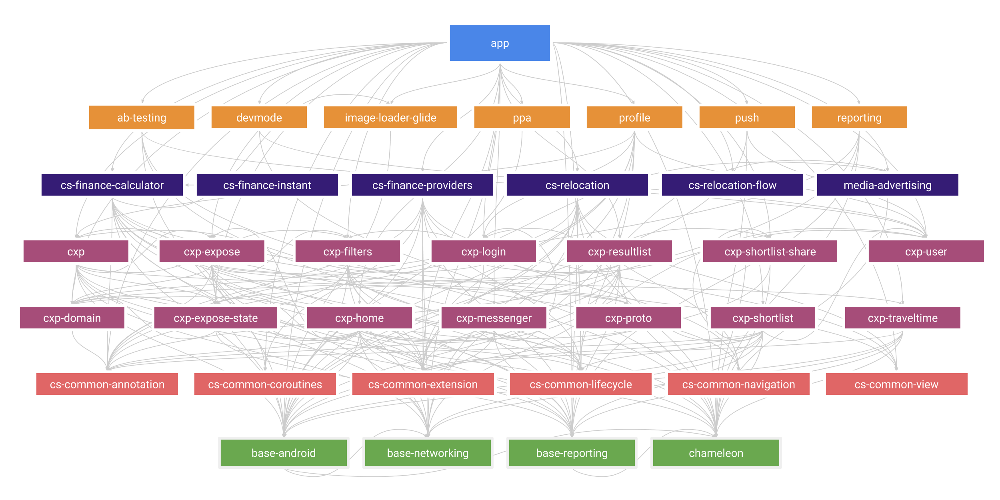

^ Highly modularised, mostly unidirectional dependency flow

^ Mostly unidirectional hierarchical dependence (work in progress)

^ Vertically structured architectural hierarchy

^ Top-level module, feature, and base modules

---
 
Flat Hierarchy


^ Aim to achieve independent modules

^ Horizontal (flat) hierarchy

^ `internal` encapsulated implementation

---


^ Already put work into heavy modularisation

^ Why not one step further?

^ Prime candidate for an instant app

---

[.background-color: #ffffff]


^ Distribute bundle with resources

^ Defers apk build and signing to Google Play

^ Keys stored with Google secure infrastructure

^ Check out Ben's talk

---

[.background-color: #ffffff]

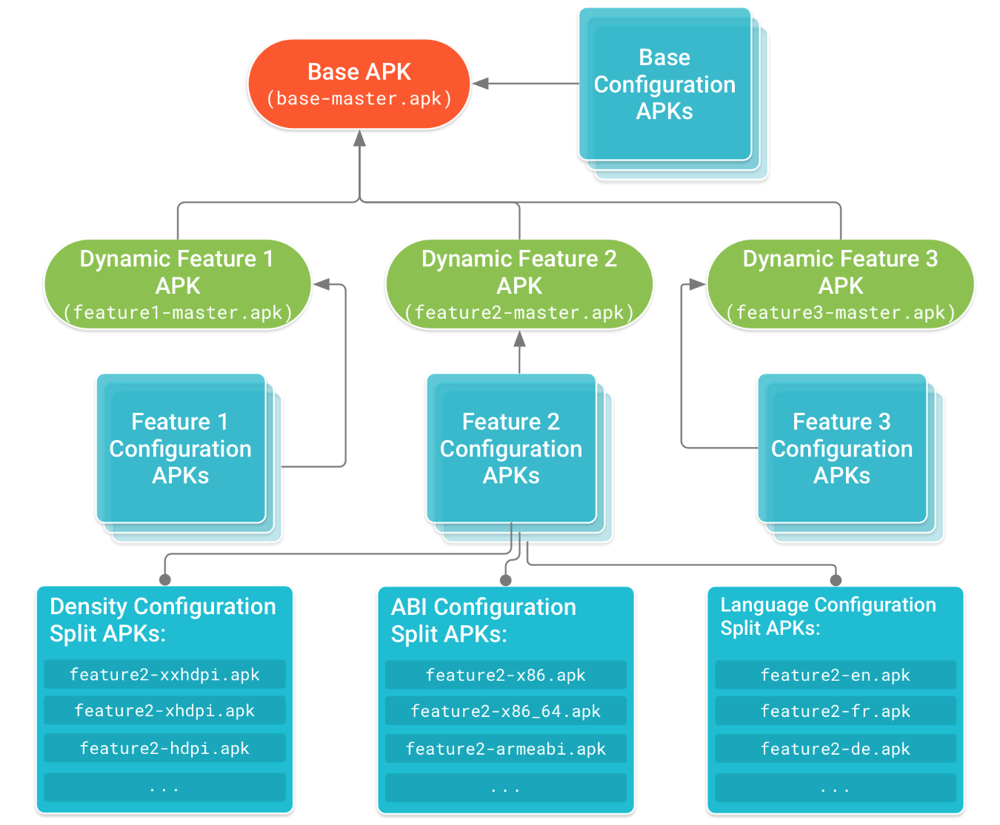

Dynamic Feature

^ Similar to instant apps, shipped with installed app

^ Allows user to download features on-demand

^ Ship smaller apk, great for secondary features

---


^ Not there yet, still need to ensure within limitation

^ Started analysing build artifact to reduce size

^ Looking for optimisation opportunities

---

# Optimisations

- Code minification (`minifyEnabled`)

- Resource shrinking (`shrinkResources`)

- Optimised SVG assets (`bit.ly/2SeZePQ`)

- Configuration splits (`splits { }`)

- Third party SDKs 😲

^ Remove rasterised images

^ Optimised vector graphics
 
^ Avocado SVG optimiser

^ Density, processor, language

---

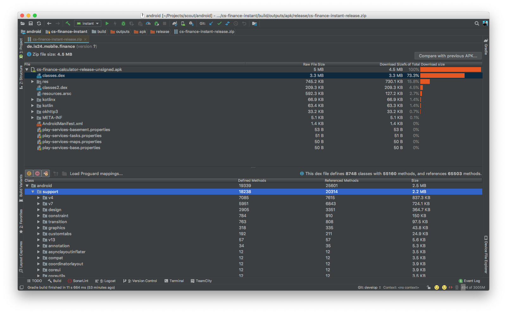

^ How can you identify size of your dependencies

^ Android Studio allows analysis of instant app apk

---

## Proguard / R8 🤦‍♂️

^ Verify proguard configuration (I didn't)

---

## Third Party SDKs 🙄

^ Twitter question: largest library dependency to remove?

^ Not sure about you, reporting frameworks, all of them

---

## Data Binding 😥

```
Error: Currently, data binding does not work for non-base feature modules.
Please, move data binding code to the base feature module.
See https://issuetracker.google.com/63814741 for details
```

---

## Data Binding 😌

`android.enableExperimentalFeatureDatabinding=true`

---

## Navigation

`Intent(context, CalculatorActivity::class.java)`

^ You may be used to creating intents like this

---

## Navigation

~~`Intent(context, CalculatorActivity::class.java)`~~

^ No dice, intents cannot reference activity directly

---

## App Links

---

```xml
<activity android:name=".calculator.CalculatorActivity">
  <intent-filter>

    <action android:name="android.intent.action.VIEW"/>

    <category android:name="android.intent.category.DEFAULT"/>
    <category android:name="android.intent.category.BROWSABLE"/>

    <data android:host="www.immobilienscout24.de"
        android:path="/baufinanzierung/finanzierungsrechner/"
        android:scheme="https"/>

  </intent-filter>
</activity>
```

^ App linking URL parameters

---

```xml, [.highlight: 9-11]
<activity android:name=".calculator.CalculatorActivity">
  <intent-filter>

    <action android:name="android.intent.action.VIEW"/>

    <category android:name="android.intent.category.DEFAULT"/>
    <category android:name="android.intent.category.BROWSABLE"/>

    <data android:host="www.immobilienscout24.de"
        android:path="/baufinanzierung/finanzierungsrechner/"
        android:scheme="https"/>

  </intent-filter>
</activity>
```

^ Matches explicit URL

^ Use pathPrefix for parameters

---

## Intent Extras

```kotlin
val intent = Intent(context, CalculatorActivity::class.java)
intent.putExtra("location", "Berlin")
```

---

[.background-color: #ffffff]

## ❗

^ Nope!

---

## Query Params

### `intent.data?.getQueryParameter("location")`

^ Nullable parameters via query param

^ Don't use intent parameters

---

## ?

^ Nullable

---

## Query Params

```kotlin
val geocode = intent.data?.getQueryParameter("location")
val label = intent.data?.getQueryParameter("label")

val region = if (geocode != null && label != null) Region(geocode, label)
else null
```

^ Problem compounded when you create objects

---

## Query Params

```kotlin
data class Region(val geocode: String, val label: String) {

  companion object {
  
    operator fun invoke(
      geocode: String?,
      label: String?
    ) : Region(
      geocode ?: "1276001010", 
      label ?: "Berlin - Mitte (Mitte)"
    )
  }
}
```

^ Operator invocation companion function mirrors constructor API

---

## Query Params

```kotlin
val region = Region(
    intent.data?.getQueryParameter("location"),
    intent.data?.getQueryParameter("label")
)
```

---

## Verify Site Associations

^ Digital asset link json file

^ Published to your website

^ Verify ownership

---

### `keytool -list -v -keystore release.keystore`

^ Use keytool to retrieve keystore fingerprint

----

```
[{
  "relation": ["delegate_permission/common.handle_all_urls"],
  "target": {
    "namespace": "android_app",
    "package_name": "de.is24.android",
    "sha256_cert_fingerprints": ["..."]
  }
}]
```
---


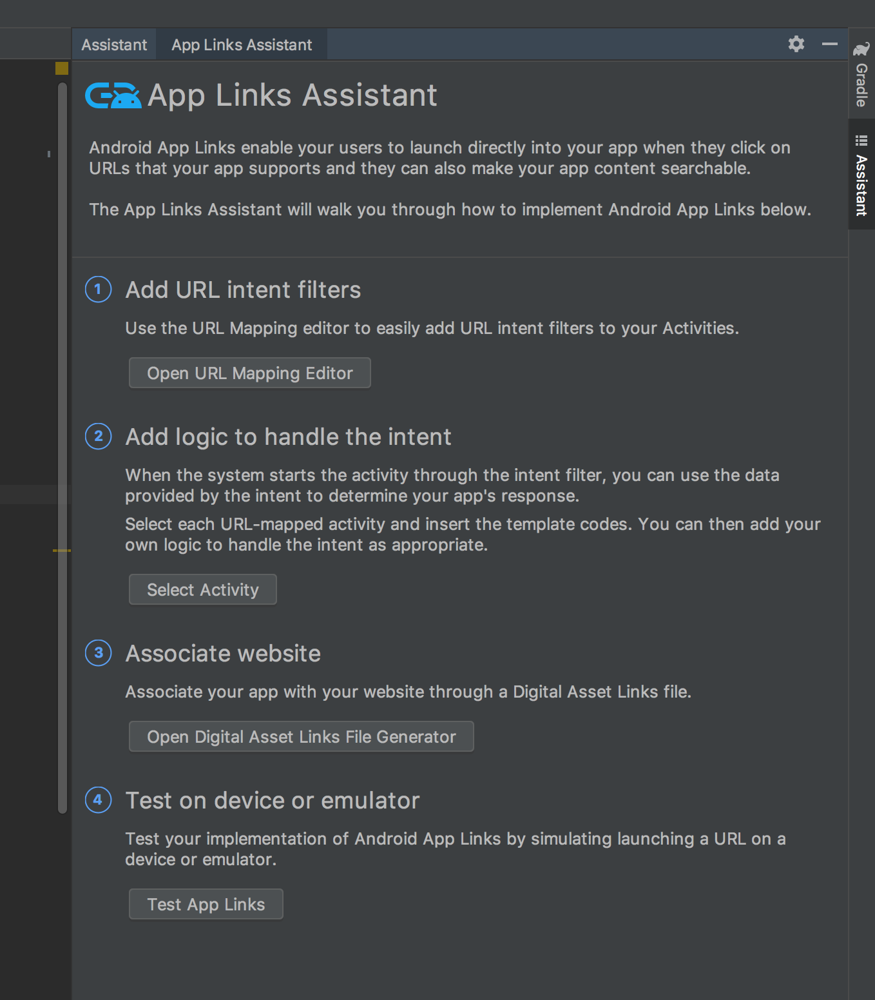

^ Android Studio includes app link assistant

^ URL mapping editor to build app links

^ Generate URL verification file to upload to your server

---

# <br />

# Emulator
# Support


^ Android Emulator supports instant apps

^ Can be used to test your app links

---

# Topeka

### github.com/googlesamples/android-topeka

^ Topeka from Ben Weiss

^ Instant app without URL

---

# Plaid

### github.com/nickbutcher/plaid

^ Plaid with Nick, Florina, Ben

^ Dynamic feature and distribution

---

## Next Steps

^ Hoped to demonstrate at conference

^ Finance calculator shipping before end of year

^ Search funnel 'Try Now' shipping before BER

---

[.footer: ashdavies.io - @askashdavies]


# Cheers! 🍻


^ https://issuetracker.google.com/issues/63814741
