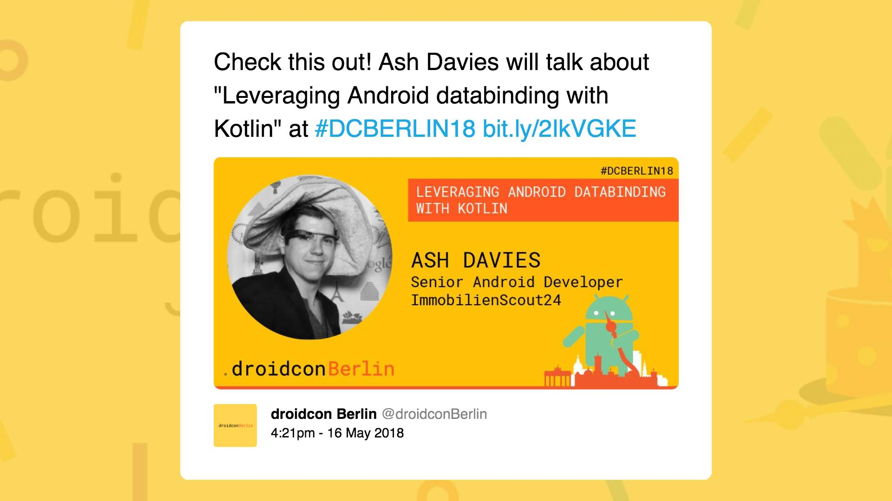

footer: ashdavies.io
slidenumbers: true
autoscale: true


# Leveraging Android Databinding<br /> with Kotlin

^ - Speaker introduction.

---

## 2018

^ - This year I would make more of an effort to give talks.

---


^ - Prepared 5-6 talks to submit to call for papers in Berlin, London, Amsterdam.

^ - Prayed to the gods, salt over my shoulder, sacrificed a goat.

---


^ - Email from Droidcon, thanks for your submission.

^ - I expected one of the familiar thanks but sorry not this time.

---


## You're in!

^ - That was at the end of April,

^ - Two months to go right?

---


^ - May goes by,

^ - Hot summer.

---



^ - In May I was mentioned in a Tweet from @droidconBerlin

^ - Pretty proud ... except for the avatar.

---


^ - Not even started, but panic then began to set in.

---


^ - So I get writing,

^ - and writing,

^ - and writing.

---

## ContentOverflowException!

^ - Too much content for my 20 minute time slot.

^ - 20 minutes probably not worth panicking over.

---


^ - The talk went pretty well, received good feedback.

^ - Extra content, out-takes, more gifs.

---

## Android Data Binding

---

## What is Data Binding?


^ - Support lib binds UI components to data sources declaratively not programmatically.

^ - Potentially powerful and complex, used effectively reduces presentation boilerplate.

---

## Android Data Binding

^ - What is Android Data binding?

^ - Support lib binds UI components to data sources declaratively not programmatically.

^ - Potentially powerful and complex, used effectively reduces presentation boilerplate.

---

## Data Binding Beta
### 2015

^ - Google announced beta release as support library can be used with Android 2.1 (API 7).

^ - Write declarative layouts, minimise glue code to bind application logic and layouts.

---

## Data Binding Sample


^ - Eager to demonstrate this, I created a sample on GitHub and Google Play Store.

^ - Application fetches GitHub repositories for a given user.

^ - Received with monumental success.

---

## Data Binding Sample


^ - Example of one of the many quality reviews.

^ - Application received two, one star ratings.

---

## Data Binding Re-Sample
### github.com/ashdavies/data-binding


^ - Updated project demonstrates techniques in this talk

^ - Code is open source available on GitHub

---

## Data Binding Re-Sample

- Kotlin Coroutines

^ - Coroutines is really enjoyable for asynchronous operations.

---

## Data Binding Re-Sample

- Kotlin Coroutines
- Constraint Layout

^ - ConstraintLayout compliments simplicity of effective data binding expressions.

---

## Data Binding Re-Sample

- Kotlin Coroutines
- Constraint Layout
- Architecture Components

^ - Data binding works very well with live data and view models.

---

## Data Binding Re-Sample

- Kotlin Coroutines
- Constraint Layout
- Architecture Components
- Moshi Codegen

^ - Moshi now compatible with Kotlin data classes

---

## Data Binding Re-Sample

- Kotlin Coroutines
- Constraint Layout
- Architecture Components
- Moshi Codegen
- Blockchain

---

## Data Binding Re-Sample

- Kotlin Coroutines
- Constraint Layout
- Architecture Components
- Moshi Codegen
- Blockchain
- AR / VR


---

## Data Binding Re-Sample

- Kotlin Coroutines
- Constraint Layout
- Architecture Components
- Moshi Codegen
- ~~Blockchain~~
- ~~AR / VR~~  

^ - Maybe not those last two.

---

## Setup

^ - How can we start working with data binding?

---

## Setup

**build.gradle**

```groovy, [.highlight: 2-4]
android {
  dataBinding {
    enabled = true
  }
}
```

^ - Should use the latest AGP version, but supported back to v1.5.0.

^ - Annotation processor not necessary, AGP will inject the correct version.

---

## Data Binding v2

^ - AGP 3.1.0 includes the new Data binding compiler to generate bindings

^ - Enabled by default as of AGP 3.2

---

## Data Binding v2

### Incremental class generation ⚡

^ - Incremental class generation to speed up your build times

---

## Data Binding v2

### Incremental class generation ⚡

### Pre-compilation class generation 💪

^ - Generates abstract bindings prior to managed compiler build.

^ - Classes available even if you bugger up your build.

---

## Getting Started

^ - Lets consider the current problem we are trying to solve.


---

## Data Binding

```kotlin
class RepoActivity : AppCompatActivity() {

  override fun onCreate(savedInstanceState: Bundle?) {
    super.onCreate(savedInstanceState)
    setContentView(R.layout.activity_repo)
  }
}
```

^ - Starting with basic usage of data binding

---

## Data Binding

```kotlin, [.highlight: 3, 8]
class RepoActivity : AppCompatActivity() {

  private lateinit var binding: ActivityRepoBinding

  override fun onCreate(savedInstanceState: Bundle?) {
    super.onCreate(savedInstanceState)

    binding = DataBindingUtil.setContentView(this, R.layout.activity_repo)
  }
}
```

^ - Store replaced framework setContentView with data binding util

---

## Data Binding

```kotlin, [.highlight: 9]
internal class RepoActivity : AppCompatActivity() {

  private lateinit var binding: ActivityRepoBinding

  override fun onCreate(savedInstanceState: Bundle?) {
    super.onCreate(savedInstanceState)

    binding = DataBindingUtil.setContentView(this, R.layout.activity_repo)
    binding.setLifecycleOwner(this)
  }
}
```

^ - From AGP 3.1 data binding is lifecycle aware, allowing lifecycle components.

^ - Inform binding of lifecycle owner to manage lifecycle subscription.

---

## Data Binding

```kotlin, [.highlight: 4, 12, 17]
internal class Repoactivity : AppCompatActivity() {

  private lateinit var binding: ActivityRepoBinding
  private lateinit var service: RepoService

  override fun onCreate(savedInstanceState: Bundle?) {
    super.onCreate(savedInstanceState)

    binding = DataBindingUtil.setContentView(this, R.layout.activity_repo)
    binding.setLifecycleOwner(this)

    service = RepoServiceFactory().get()
  }

  override fun onResume() {
    super.onResume()
    service.fetch { binding.items = it }
  }
}
```

^ - Finally domain behaviour passes items to view binding

---

## Layout (XML 🤦‍♀️)

```xml
<layout xmlns:android="http://schemas.android.com/apk/res/android"
    xmlns:app="http://schemas.android.com/apk/res-auto">

  <data>

    <variable
        name="items"
        type="java.util.List&lt;io.ashdavies.databinding.Repo&gt;"/>

  </data>

  <androidx.coordinatorlayout.widget.CoordinatorLayout... />
</layout>
```

^ - Data binding layouts require variables within data tags

^ - Like string resources generic list type requires encoding of HTML entities

---

## Data Binding

```kotlin
class RepoActivity : AppCompatActivity() {

  private lateinit var binding: ActivityRepoBinding
  private lateinit var service: RepoService

  override fun onCreate(savedInstanceState: Bundle?) {
    super.onCreate(savedInstanceState)

    binding = DataBindingUtil.setContentView(this, R.layout.activity_home)
    binding.setLifecycleOwner(this)

    service = RepoServiceFactory().get()
  }

  override fun onResume() {
    super.onResume()
    service.fetch { binding.items = it }
  }
}
```

^ - Not yet an improvement, presentation behaviour contained in activity

^ - How can we use Kotlin to improve it this.

^ - Lets start with the binding.

---

## Delegated Properties


^ - Kotlin allows us to use delegated properties.
 
^ - Create template for getter and setter to reuse.

^ - Reduce boilerplate property accessors.

---

## Delegated Properties

```kotlin
val value: String by lazy {
  println("computed!")
  "Hello"
}
```

^ - Kotlin Lazy delegate would compute the value once.

^ - Delegate indicated with use of "by" keyword.

---

## Delegated Properties

```kotlin
interface ReadOnlyProperty<in R, out T> {
  operator fun getValue(thisRef: R, property: KProperty<*>): T
}

interface ReadWriteProperty<in R, T> {
  operator fun getValue(thisRef: R, property: KProperty<*>): T
  operator fun setValue(thisRef: R, property: KProperty<*>, value: T)
}
```

^ - Two interfaces for delegated properties for val and var.

^ - Binding property is immutable.

---

## Delegated Properties

```kotlin
class ActivityBindingProperty<out T : ViewDataBinding> : ReadOnlyProperty<Activity, T> {

  override operator fun getValue(thisRef: Activity, property: KProperty<*>): T {
    TODO("not implemented")
  }
}
```

^ - Our binding property is an immutable value so we need ReadOnlyProperty.

---

## Delegated Properties

```kotlin, [.highlight: 2, 9-11]
class ActivityBindingProperty<out T : ViewDataBinding>(
  @LayoutRes private val resId: Int
) : ReadOnlyProperty<Activity, T> {

  override operator fun getValue(thisRef: Activity, property: KProperty<*>): T {
    TODO("not implemented")
  }

  private fun createBinding(activity: Activity): T {
    return DataBindingUtil.setContentView(activity, resId)
  }
}
```

^ - Require layout resource identifier to set content view

---

## Delegated Properties

```kotlin, [.highlight: 5, 8]
class ActivityBindingProperty<out T : ViewDataBinding>(
  @LayoutRes private val resId: Int
) : ReadOnlyProperty<Activity, T> {

  private var binding: T? = null

  override operator fun getValue(thisRef: Activity, property: KProperty<*>): T {
    return binding ?: createBinding(thisRef).also { binding = it }
  }

  private fun createBinding(activity: Activity): T {
    return DataBindingUtil.setContentView(activity, resId)
  }
}
```

^ - Lazily instantiate the data binding when retrieving value.

---

## Delegated Properties

```kotlin, [.highlight: 3]
class RepoActivity : AppCompatActivity() {

  private val binding by ActivityBindingProperty<ActivityRepoBinding>(R.layout.activity_repo)

  private lateinit var service: RepoService

  override fun onCreate(savedInstanceState: Bundle?) {
    super.onCreate(savedInstanceState)
    binding.setLifecycleOwner(this)

    service = RepoServiceFactory().get()
  }

  override fun onResume() {
    super.onResume()
    service.fetch { binding.items = it }
  }
}
```

^ - No longer need to use lateinit var.

^ - Make use of Kotlin immutable val.

---

## ProTip: Extension Function! 👍

```kotlin, [.highlight: 3, 18-20]
class RepoActivity : AppCompatActivity() {

  private val binding by activityBinding<ActivityRepoBinding>(R.layout.activity_repo)

  private lateinit var service: RepoService

  override fun onCreate(savedInstanceState: Bundle?) {
    super.onCreate(savedInstanceState)
    binding.setLifecycleOwner(this)

    service = RepoServiceFactory().get()
  }

  override fun onResume() { 
    super.onResume()
    service.fetch { binding.items = it }
  }
}

fun <T : ViewDataBinding> FragmentActivity.activityBinding(
  @LayoutRes resId: Int
) = ActivityBindingProperty(resId)
```

^ - Kotlin property delegates are provided via extension function.

^ - Reads nicely when written from receiving class.

---

## Data Binding

```kotlin, [.highlight: 3, 9]
class RepoActivity : AppCompatActivity() {

  private val binding by activityBinding<ActivityRepoBinding>(R.layout.activity_repo)

  private lateinit var service: RepoService

  override fun onCreate(savedInstanceState: Bundle?) {
    super.onCreate(savedInstanceState)
    binding.setLifecycleOwner(this)

    service = RepoServiceFactory().get()
  }

  override fun onResume() { 
    super.onResume()
    service.fetch { binding.items = it }
  }
}

fun <T : ViewDataBinding> FragmentActivity.activityBinding(
  @LayoutRes resId: Int
) = ActivityBindingProperty(resId)
```

^ - Lazy won't instantiate unless referenced in onCreate.

^ - Domain behaviour still not testable.

---

### Introducing
## Android Architecture Components


^ - Google announced architecture components last year at Google IO.

^ - Announced JetPack this year to quickly build framework applications.

^ - Including LiveData and ViewModel working well with MVVM design pattern.

---

## Model-View-ViewModel

^ - Not an instruction to migrate application architecture.

^ - Suggestion design pattern for fresh projects.

^ - Data binding works well with MVVM, view state designed to be observed.

^ - Multiple or no observers, view nullability (if destroyed) irrelevant.

^ - Lifecycle aware components react accordingly to presence of owner.

---


^ - VM state bound to view by observation.

^ - View notifies VM of UI events from user interaction.

^ - VM responsible for business logic behaviour.

^ - No Android dependencies.

---

## Model-View-ViewModel

```kotlin
class RepoActivity : AppCompatActivity() {

  private val binding by activityBinding<ActivityRepoBinding>(R.layout.activity_repo)

  override fun onCreate(savedInstanceState: Bundle?) {
    super.onCreate(savedInstanceState)
    binding.setLifecycleOwner(this)
  }
}
```

^ - Domain behaviour now removed from activity

---

## Model-View-ViewModel

```kotlin, [.highlight: 9-11]
class RepoActivity : AppCompatActivity() {

  private val binding by activityBinding<ActivityRepoBinding>(R.layout.activity_repo)

  override fun onCreate(savedInstanceState: Bundle?) {
    super.onCreate(savedInstanceState)
    
    binding.setLifecycleOwner(this)
    binding.model = ViewModelProviders
        .of(this, RepoViewModelFactory())
        .get(RepoViewModel::class.java)
  }
}
```

^ - View model retrieved from AppCompatActivity VM providers.

^ - Factory to instantiate if VM not already created.

^ - Activity VM store retrieved from non configuration instance in onCreate.

---

## ProTip: Extension Function! 👍

```kotlin, [.highlight: 9, 13-15]
class RepoActivity : AppCompatActivity() {

  private val binding by activityBinding<ActivityRepoBinding>(R.layout.activity_repo)

  override fun onCreate(savedInstanceState: Bundle?) {
    super.onCreate(savedInstanceState)
 
    binding.setLifecycleOwner(this)
    binding.model = getViewModel(RepoViewModelFactory())
  }
}

inline fun <reified T : ViewModel> FragmentActivity.getViewModel(
  factory: ViewModelProvider.Factory = ViewModelProvider.NewInstanceFactory()
) = ViewModelProviders.of(this, factory).get(T::class.java)
```

^ - Create an extension function to create VM from activity.

^ - NewInstanceFactory attempts to invoke no-arg constructor.

^ - Binding and VM created in onCreate function.

---

## Model-View-ViewModel

```xml, [.highlight: 6-8]
<layout xmlns:android="http://schemas.android.com/apk/res/android"
    xmlns:app="http://schemas.android.com/apk/res-auto">

  <data>

    <variable
        name="model"
        type="io.ashdavies.databinding.RepoViewModel"/>

  </data>

  <androidx.coordinatorlayout.widget.CoordinatorLayout... />
</layout>
```

^ - Data binding layout now binds VM.

---

## Model-View-ViewModel

```kotlin, [.highlight: 4, 10, 12]
class RepoActivity : AppCompatActivity() {

  private val binding by activityBinding<ActivityRepoBinding>(R.layout.activity_repo)
  private val model by lazy { getViewModel<RepoViewModel>(RepoViewModelFactory()) }

  override fun onCreate(savedInstanceState: Bundle?) {
    super.onCreate(savedInstanceState)

    binding.setLifecycleOwner(this)
    binding.model = model
  }
}
```

^ - Combine with lazy instantiation to trim down activity.

^ - Binding and VM created in onCreate function.

---

## ViewModel

```kotlin
class RepoViewModel(service: RepoService) : ViewModel {

  val items: ObservableField<List<String>> = ObservableField()

  fun query(value: String) {
    service.fetch(value, items::set)
  }
}
```

^ - Data Binding provides observable class wrappers to notify of data changes

^ - Primitive types: Boolean, Byte, Char, Short, Int, Long, Float, Double, Parcelable.

---

## Observable

```kotlin, [.highlight: 3]
class RepoViewModel(service: RepoService) : ViewModel {

  val items: ObservableField<List<String>> = ObservableField()

  fun query(value: String) { /* ... */ }
}
```

^ - Implement observable interface to add and remove property change listeners.

^ - Extending from BaseObservable to implement using property change registry.

^ - Extend from this for complex objects, usefulness apparent later.

---

## LiveData Data Binding


^ - From AGP 3.1 Live Data can be used with Data Binding with lifecycle owner

---

## LiveData Data Binding

```kotlin, [.highlight: 3]
class RepoViewModel(service: RepoService) : ViewModel {

  val items = MutableLiveData<List<String>>()

  fun query(value: String) { /* ... */ }
}
```

^ - ObservableField listeners notified regardless of lifecycle state.

^ - Unlike observables LiveData lifecycle aware, more granular control.

^ - Provides additional benefits, transformations, lifecycle owner observation.

---

## ProTip: Extension Functions! 👍

```kotlin, [.highlight: 3, 8]
class RepoViewModel(service: RepoService) : ViewModel {

  val items = mutableLiveData<List<String>>()

  fun query(value: String) { /* ... */ }
}

fun <T> ViewModel.mutableLiveDataOf() = MutableLiveData<T>()
```

^ - If familiar with Kotlin mutableListOf create for LiveData

^ - Minor changes like this help make your code more consistent, and readable.

---

## LiveData Data Binding
### Transformations

^ - LiveData allows you to transform the value before dispatching the update to observers.

^ - Will only transform if there are active observers.

---

## LiveData Transformations

```kotlin, [.highlight: 4-8]
class RepoViewModel(private val service: RepoService) : ViewModel {

  val items = mutableLiveDataOf<List<String>>()
  val kotlin = map(items) {
    it.filter {
        it.contains("Kotlin") 
    }
  }
  
  fun query(value: String) {
    service.fetch(value) {
      items.value = it
    }
  }
}
```
---

## LiveData Data Binding
### MediatorLiveData

^ - Another benefit of live data is usage of MediatorLiveData.

^ - Apply complex logic and product an observable source.

---

## MediatorLiveData Data Binding

```kotlin
class EmptyLiveData<in T>(items: LiveData<List<T>>, loading: LiveData<Boolean>) : MediatorLiveData<Boolean>() {

  init {
    addSource(items) { value = it?.isEmpty() ?: false && loading.value ?: false }
    addSource(loading) { value = it ?: false && items.value?.isEmpty() ?: false }
    value = true
  }
}
```

^ - Mediator live data allows you to ad multiple sources.

^ - Observers triggered when either of the sources change.

---

## ViewModel

```kotlin
class RepoViewModel(private val service: RepoService) : ViewModel {

  val items = mutableLiveDataOf<List<String>>()

  fun query(value: String) {
    service.fetch(value) {
      items.value = it
    }
  }
}
```

^ - Basic asynchronous operation to fetch repos from service given user as query.

^ - Assume appropriate threading implementation.

---

## ViewModel

```kotlin, [.highlight: 4, 7, 10]
class RepoViewModel(private val service: RepoService) : ViewModel {

  val items = mutableLiveDataOf<List<String>>()
  val loading = mutableLiveDataOf<Boolean>()

  fun query(value: String) {
    loading.value = true
    
    service.fetch(value) {
      loading.value = false
      items.value = it
    }
  }
}
```

^ - Show a progress bar to indicate loading state.

---

## Layout Expressions

```xml, [.highlight: 6, 14-15]
<layout xmlns:android="http://schemas.android.com/apk/res/android"
    xmlns:app="http://schemas.android.com/apk/res-auto">

  <data>

    <import type="android.view.View"/>

    <variable
        name="model"
        type="io.ashdavies.databinding.RepoViewModel"/>

  </data>

  <ProgressBar...
      android:visibility="@{model.loading ? View.VISIBLE : View.GONE}"/>

</layout>
```

^ - Data Binding subscribes to the view model state.

^ - Progress bar visibility updated from loading boolean.

^ - Boolean two state transformed to three state visibility.

^ - Must import View for variable usage in binding expressions.

---

## Layout Expressions

```xml, [.highlight: 14-15]
<layout xmlns:android="http://schemas.android.com/apk/res/android"
    xmlns:app="http://schemas.android.com/apk/res-auto">

  <data>

    <import type="android.view.View"/>

    <variable
        name="model"
        type="io.ashdavies.databinding.RepoViewModel"/>

  </data>

  <TextView...
      android:text="@string/activity_repo_empty"/>

  <ProgressBar...
      android:visibility="@{model.loading ? View.VISIBLE : View.GONE}"/>

</layout>
```

^ - What if we want to display an empty state?

---

## Layout Expressions

```xml, [.highlight: 14-16]
<layout xmlns:android="http://schemas.android.com/apk/res/android"
    xmlns:app="http://schemas.android.com/apk/res-auto">

  <data>

    <import type="android.view.View"/>

    <variable
        name="model"
        type="io.ashdavies.databinding.RepoViewModel"/>

  </data>

  <TextView...
      android:text="@string/activity_repo_empty"
      android:visibility="@{model.items.count == 0 ? View.VISIBLE : View.GONE}"/>

  <ProgressBar...
      android:visibility="@{model.loading ? View.VISIBLE : View.GONE}"/>

</layout>
```

^ - Data Binding allows evaluation statements in binding expressions.

^ - Would also show when state is loading.

---

## Layout Expressions

```xml, [.highlight: 14-16]
<layout xmlns:android="http://schemas.android.com/apk/res/android"
    xmlns:app="http://schemas.android.com/apk/res-auto">

  <data>

    <import type="android.view.View"/>

    <variable
        name="model"
        type="io.ashdavies.databinding.RepoViewModel"/>

  </data>

  <TextView...
      android:text="@string/activity_repo_empty"
      android:visibility="@{model.items.count == 0 &amp;&amp; !model.loading ? View.VISIBLE : View.GONE}"/>

  <ProgressBar...
      android:visibility="@{model.loading ? View.VISIBLE : View.GONE}"/>

</layout>
```

^ - Include check for loading state.

^ - Binding expressions must escape html entities.

^ - Obvious problem.

---

## Too Complicated!

^ - Easy to end up with complicated binding expressions.

^ - Pollutes layouts with business logic.

^ - Misuse of toolset discourages developers.


---

## Single Property Expressions

```kotlin, [.highlight: 5, 9, 13]
class RepoViewModel(private val service: RepoService) : ViewModel {

  val items = mutableLiveDataOf<List<String>>()
  val loading = mutableLiveDataOf<Boolean>()
  val empty = mutableLiveDataOf<Boolean>()
  
  fun query(value: String) {
    loading.value = true
    empty.value = true
    
    service.fetch(value) {
      items.value = it
      empty.value = it.isEmpty()
      loading.value = false  
    }
  }
}
```

^ - Breaking off empty value.

^ - Duplication easily testable.

---

```xml, [.highlight: 14-16]
<layout xmlns:android="http://schemas.android.com/apk/res/android"
    xmlns:app="http://schemas.android.com/apk/res-auto">

  <data>

    <import type="android.view.View"/>

    <variable
        name="model"
        type="io.ashdavies.databinding.RepoViewModel"/>

  </data>

  <TextView...
      android:text="@string/activity_repo_empty"
      android:visibility="@{model.empty ? View.VISIBLE : View.GONE}"/>

  <ProgressBar...
      android:visibility="@{model.loading ? View.VISIBLE : View.GONE}"/>

</layout>
```

^ - Already an improvement, but we can do better.

---

## `@BindingAdapter`

^ - Data Binding allows specification of binding adapters

^ - Additional logic for bindings

---

## `@BindingAdapter`

```kotlin
@BindingAdapter("goneUnless")
fun goneUnless(view: View, visible: Boolean) {
  view.visibility = if (visible) View.VISIBLE else View.GONE
}
```

^ - Binding allows removal of layout conditional statement

^ - Testable function

---

## ProTip: Extension Property! 👍

```kotlin
@set:BindingAdapter("isVisible")
inline var View.isVisible: Boolean
  get() = visibility == View.VISIBLE
  set(value) {
    visibility = if (value) View.VISIBLE else View.GONE
  }
```

^ - Extension property from KTX library.

^ - Also available programmatically.

---

## `@BindingAdapter`

```xml, [.highlight: 14-16, 18-19]
<layout xmlns:android="http://schemas.android.com/apk/res/android"
    xmlns:app="http://schemas.android.com/apk/res-auto">

  <data>

    <import type="android.view.View"/>

    <variable
        name="model"
        type="io.ashdavies.databinding.RepoViewModel"/>

  </data>

  <TextView...
      android:text="@string/activity_repo_empty"
      app:isVisible="@{model.empty}"/>

  <ProgressBar...
      app:isVisible="@{model.loading}"/>

</layout>
```

^ - XML good, VM could be improved.

^ - We can do better!

---

## Simple Properties

^ - In addition to binding adapters data binding can detect simple properties with java bean accessors.

---

## Simple Properties

- `android:text="@{model.name}"`
  - `fun TextView.setText(value: String)`
  - `fun ViewModel.getName(): String`

^ - One way binding expression.

^ - Looks for set text on view.

^ - Looks for get name on view model.

---

## Simple Properties

- `android:text="@{model.name}"`
  - `fun TextView.setText(@StringRes resId: Int)`
  - `@StringRes fun ViewModel.getName(): Int`

^ - Will automatically look for the same parameter type by the same name.

---

## `@BindingAdapter`
### Event Handling

^ - Binding adapters can be used for more than just handling binding expressions.

^ - Used to handle event listeners

---

## Event Handling

```kotlin
@BindingAdapter("android:onQueryTextChange")
fun setOnQueryTextListener(view: SearchView, listener: OnQueryTextChange) {
  view.setOnQueryTextListener(object : SearchView.OnQueryTextListener {

    override fun onQueryTextSubmit(it: String): Boolean = true
    override fun onQueryTextChange(it: String): Boolean = listener(it)
  })
}

interface OnQueryTextChange {

  operator fun invoke(string: String): Boolean
}
```

^ - This binding adapter is setting a listener on query text change if we don't care about submit.

^ - You may be tempted to use a high order function but this will not work due to signature conflicts.

---


---

## Event Handling

```xml
<androidx.appcompat.widget.SearchView
    android:id="@+id/search"
    android:layout_width="wrap_content"
    android:layout_height="wrap_content"
    android:layout_gravity="end"
    android:onQueryTextChange="@{(value) -> model.onQuery(value)}">
```

^ - Data binding then allows you to use a Java 8 style lambda to simplify the interface implementation.

---

## Event Handling

```xml
<androidx.appcompat.widget.SearchView
    android:id="@+id/search"
    android:layout_width="wrap_content"
    android:layout_height="wrap_content"
    android:layout_gravity="end"
    android:onQueryTextChange="@{model::onQuery}">
```

^ - Because the method signatures match, we can use a method reference!

---


---

## `@BindingMethods`

^ - Even when your attributes do not match by name, use a binding method annotation.

^ - Inverse binding method for two way binding.

---

## `@BindingMethods`

```java
@BindingMethods({
  @BindingMethod(
      type = TextView.class, 
      attribute = "android:inputType", 
      method = "setRawInputType"
  )
})
public class TextViewBindingAdapter { /* ... */ }

```

^ - Example provided by data binding library.

^ - Instructs data binding to use alternative method.

---

## `@Bindable`


^ - Remember ObservableField extends BaseObservable?

^ - BaseObservable uses PropertyChangeRegistry.

^ - Applied to generated binding properties from layout.

^ - Can be applied to any accessor or property.

---

## `@Bindable`

```java
public class BR {
  public static final int _all = 0;

  public static final int item = 1;

  public static final int model = 2;

  public static final int empty = 3;
}
```

^ - Generates binding resource files, similar to android R.

^ - Used to identify binding properties programatically.

^ - Notify binding classes that property needs updating.

---

## `@Bindable`

### ObservableViewModel

^ - Create bindable VM properties by extending from Observable interface.

---

## `@Bindable`

### PropertyChangeRegistry

^ - BaseObservable uses property change registry to add and remove notification listeners.

---

## `@Bindable`

```kotlin
abstract class ObservableViewModel : ViewModel(), Observable {

  private val callbacks: PropertyChangeRegistry = PropertyChangeRegistry()

  override fun addOnPropertyChangedCallback(callback: Observable.OnPropertyChangedCallback) {
    callbacks.add(callback)
  }

  override fun removeOnPropertyChangedCallback(callback: Observable.OnPropertyChangedCallback) {
    callbacks.remove(callback)
  }

 fun notifyChange() {
    callbacks.notifyCallbacks(this, 0, null)
  }

 fun notifyPropertyChanged(fieldId: Int) {
    callbacks.notifyCallbacks(this, fieldId, null)
  }
}
```

^ - Observable implementation allows callback registration.

^ - Notify methods invoke callbacks on property change registry.

^ - Notify all properties as changed.

^ - Notify individual field granular control.

---

## `@Bindable`

```kotlin, [.highlight: 1]
class RepoViewModel(private val service: RepoService) : ObservableViewModel {

  val items = mutableLiveDataOf<List<String>>()
  val loading = mutableLiveDataOf<Boolean>()

  fun query(value: String) {
    loading.value = true
    
    service.fetch(value) {
      loading.value = false
      items.value = it
    }
  }
}
```

^ - Extend view model from observable view model.

^ - Lets change items to a bindable property.

---

## `@Bindable`

```kotlin, [.highlight: 3-8]
class RepoViewModel(private val service: RepoService) : ObservableViewModel {

  @get:Bindable
  var items: List<String> = emptyList()
    private set(value) {
      notifyPropertyChanged(BR.items)
      field = value
    }
      
  val loading = mutableLiveDataOf<Boolean>()

  fun query(value: String) {
    loading.value = true
    
    service.fetch(value) {
      loading.value = false
      items = it
    }
  }
}
```

^ - Advantage of actual property over a wrapper class.

^ - Private setter restricts modification.

^ - Verbose boilerplate.

^ - We can do better.

---

## `@Bindable`
### Delegated Properties


^ - Remember our delegated properties.

^ - Reduce boilerplate property accessors with delegated properties.

^ - Create template for getter and setter to reuse elsewhere.

---

## Property Delegate
### ObservableProperty

---

## `@Bindable`

```kotlin
class BindableProperty<T>(
  initial: T, private val observable: ObservableViewModel, private val id: Int
) : ObservableProperty<T>(initial) {

  override fun beforeChange(
    property: KProperty<*>, oldValue: T, newValue: T
  ): Boolean = { /* ... */ }

  override fun afterChange(
    property: KProperty<*>, oldValue: T, newValue: T
  ) { /* ... */ }
}
```

^ - Extend observable property to manage observable notifications

---

## `@Bindable`

```kotlin, [.highlight: 5-7]
class BindableProperty<T>(
  initial: T, private val observable: ObservableViewModel, private val id: Int
) : ObservableProperty<T>(initial) {

  override fun beforeChange(
    property: KProperty<*>, oldValue: T, newValue: T
  ): Boolean = oldValue != newValue

  override fun afterChange(
    property: KProperty<*>, oldValue: T, newValue: T
  ) { /* ... */ }
}
```

^ - First callback indicates whether property change is allowed.

^ - Useful to prevent two-way binding loops.

---

## `@Bindable`

```kotlin, [.highlight: 9-11]
class BindableProperty<T>(
  initial: T, private val observable: ObservableViewModel, private val id: Int
) : ObservableProperty<T>(initial) {

  override fun beforeChange(
    property: KProperty<*>, oldValue: T, newValue: T
  ): Boolean = oldValue != newValue

  override fun afterChange(property: KProperty<*>, oldValue: T, newValue: T) {
    observable.notifyPropertyChanged(id)
  }
}
```

^ - Second notifies observable of property change.

---

## ProTip: Extension Function! 👍
### `@Bindable`

```kotlin, [.highlight: 3-5, 14-16]
class RepoViewModel(private val service: RepoService) : ObservableViewModel() {

  @get:Bindable 
  var items by bindable<List<String>>(emptyList(), BR.items)
    private set

  val items = mutableLifeDataOf<List<String>>()

  init {
    service.fetch(items::setValue)
  }
}

fun <T> ObservableViewModel.bindable(initial: T, id: Int): BindableProperty<T> {
  return BindableProperty(initial, this, id)
}
```

^ - Extension function to create bindable property.

^ - Aiden McWilliams demonstrates this technique in blog post.

^ - Use reflection to look up BR property identifier.

---

## 🎉 Awesome! 🎉

^ - Many more techniques can be applied with Kotlin and data binding.

^ - No strict best practices but whats best for your project.

---

## Data Binding
### Generated Code

^ - Feedback from first talk to review generated code to see how data binding handles expressions.

^ - Doesn't always work for all formats, why?

---

```java
public class ActivityRepoBindingImpl extends ActivityRepoBinding  {
  
    @Override protected void executeBindings() {
        long dirtyFlags = 0;
        synchronized(this) {
            dirtyFlags = mDirtyFlags;
            mDirtyFlags = 0;
        }
        java.lang.Integer modelCountGetValue = null;
        io.ashdavies.databinding.databinding.OnQueryTextChange modelOnQueryIoAshdaviesDatabindingDatabindingOnQueryTextChange = null;
        boolean modelLoading = false;
        boolean modelEmpty = false;
        io.ashdavies.databinding.repos.RepoViewModel model = mModel;
        java.lang.String countAndroidPluralsRepoItemsCountModelCountModelCount = null;
        io.ashdavies.databinding.extensions.Visibility modelVisibilityGetValue = null;
        androidx.lifecycle.LiveData<java.lang.Integer> modelCount = null;
        androidx.lifecycle.MutableLiveData<java.lang.Boolean> ModelLoading1 = null;
        java.lang.Boolean modelLoadingGetValue = null;
        androidx.lifecycle.LiveData<io.ashdavies.databinding.extensions.Visibility> modelVisibility = null;
        boolean androidxDatabindingViewDataBindingSafeUnboxModelLoadingGetValue = false;
        boolean androidxDatabindingViewDataBindingSafeUnboxModelLoading = false;

        if ((dirtyFlags & 0x3fL) != 0) {
            if ((dirtyFlags & 0x21L) != 0) {
                    if (model != null) {
                        modelOnQueryIoAshdaviesDatabindingDatabindingOnQueryTextChange = (((mModelOnQueryIoAshdaviesDatabindingDatabindingOnQueryTextChange == null) ? (mModelOnQueryIoAshdaviesDatabindingDatabindingOnQueryTextChange = new OnQueryTextChangeImpl()) : mModelOnQueryIoAshdaviesDatabindingDatabindingOnQueryTextChange).setValue(model));
                    }
            }
            if ((dirtyFlags & 0x31L) != 0) {
                    if (model != null) {
                        modelEmpty = model.getEmpty();
                    }
            }
            if ((dirtyFlags & 0x23L) != 0) {
                    if (model != null) {
                        modelCount = model.getCount();
                    }
                    updateLiveDataRegistration(1, modelCount);
                    if (modelCount != null) {
                        modelCountGetValue = modelCount.getValue();
                    }
                    countAndroidPluralsRepoItemsCountModelCountModelCount = count.getResources().getQuantityString(R.plurals.repo_items_count, modelCountGetValue, modelCountGetValue);
                    countAndroidPluralsRepoItemsCountModelCountModelCount = count.getResources().getQuantityString(R.plurals.repo_items_count, modelCountGetValue, modelCountGetValue);
            }
            if ((dirtyFlags & 0x25L) != 0) {
                    if (model != null) {
                        ModelLoading1 = model.getLoading();
                    }
                    updateLiveDataRegistration(2, ModelLoading1);
                    if (ModelLoading1 != null) {
                        modelLoadingGetValue = ModelLoading1.getValue();
                    }
                    androidxDatabindingViewDataBindingSafeUnboxModelLoadingGetValue = androidx.databinding.ViewDataBinding.safeUnbox(modelLoadingGetValue);
                    modelLoading = !androidxDatabindingViewDataBindingSafeUnboxModelLoadingGetValue;
                    androidxDatabindingViewDataBindingSafeUnboxModelLoading = androidx.databinding.ViewDataBinding.safeUnbox(modelLoading);
            }
            if ((dirtyFlags & 0x29L) != 0) {
                    if (model != null) {
                        modelVisibility = model.getVisibility();
                    }
                    updateLiveDataRegistration(3, modelVisibility);
                    if (modelVisibility != null) {
                        modelVisibilityGetValue = modelVisibility.getValue();
                    }
            }
        }
        if ((dirtyFlags & 0x23L) != 0) {
            androidx.databinding.adapters.TextViewBindingAdapter.setText(this.count, countAndroidPluralsRepoItemsCountModelCountModelCount);
        }
        if ((dirtyFlags & 0x31L) != 0) {
            io.ashdavies.databinding.extensions.ViewKt.goneUnless(this.empty, modelEmpty);
        }
        if ((dirtyFlags & 0x25L) != 0) {
            io.ashdavies.databinding.extensions.ViewKt.goneUnless(this.mboundView4, androidxDatabindingViewDataBindingSafeUnboxModelLoadingGetValue);
            io.ashdavies.databinding.extensions.ViewKt.goneUnless(this.recycler, androidxDatabindingViewDataBindingSafeUnboxModelLoading);
        }
        if ((dirtyFlags & 0x29L) != 0) {
            io.ashdavies.databinding.extensions.ViewKt.setVisibility(this.recycler, modelVisibilityGetValue);
        }
        if ((dirtyFlags & 0x21L) != 0) {
            io.ashdavies.databinding.databinding.SearchViewBindingsKt.setOnQueryTextListener(this.search, modelOnQueryIoAshdaviesDatabindingDatabindingOnQueryTextChange);
        }
    }
}
```

^ - Generated data binding code is very defensive and is difficult to read.

---


---

```java
public class ActivityRepoBindingImpl extends ActivityRepoBinding  {
  
    @Override protected void executeBindings() {
        if ((dirtyFlags & 0x3fL) != 0) {
            if ((dirtyFlags & 0x21L) != 0) {
                    if (model != null) {
                        modelOnQueryIoAshdaviesDatabindingDatabindingOnQueryTextChange = (((mModelOnQueryIoAshdaviesDatabindingDatabindingOnQueryTextChange == null) ? 
                            (mModelOnQueryIoAshdaviesDatabindingDatabindingOnQueryTextChange = new OnQueryTextChangeImpl())
                            : mModelOnQueryIoAshdaviesDatabindingDatabindingOnQueryTextChange).setValue(model));
                    }
            }
            if ((dirtyFlags & 0x31L) != 0) {
                    if (model != null) {
                        modelEmpty = model.getEmpty();
                    }
            }
            if ((dirtyFlags & 0x25L) != 0) {
                    if (model != null) {
                        ModelLoading1 = model.getLoading();
                    }
                    updateLiveDataRegistration(2, ModelLoading1);
                    if (ModelLoading1 != null) {
                        modelLoadingGetValue = ModelLoading1.getValue();
                    }
                    androidxDatabindingViewDataBindingSafeUnboxModelLoadingGetValue = androidx.databinding.ViewDataBinding.safeUnbox(modelLoadingGetValue);
                    modelLoading = !androidxDatabindingViewDataBindingSafeUnboxModelLoadingGetValue;
                    androidxDatabindingViewDataBindingSafeUnboxModelLoading = androidx.databinding.ViewDataBinding.safeUnbox(modelLoading);
            }
        if ((dirtyFlags & 0x31L) != 0) {
            io.ashdavies.databinding.extensions.ViewKt.goneUnless(this.empty, modelEmpty);
        }
        if ((dirtyFlags & 0x25L) != 0) {
            io.ashdavies.databinding.extensions.ViewKt.goneUnless(this.mboundView4, androidxDatabindingViewDataBindingSafeUnboxModelLoadingGetValue);
            io.ashdavies.databinding.extensions.ViewKt.goneUnless(this.recycler, androidxDatabindingViewDataBindingSafeUnboxModelLoading);
        }
        if ((dirtyFlags & 0x21L) != 0) {
            io.ashdavies.databinding.databinding.SearchViewBindingsKt.setOnQueryTextListener(this.search, modelOnQueryIoAshdaviesDatabindingDatabindingOnQueryTextChange);
        }
    }
}
```

^ - Upon executing the bindings flags are checked to see which properties are dirty.

^ - Values are unboxed safely where necessary.

^ - Executes specified binding adapter statically.

---

```java
public abstract class ActivityRepoBinding extends ViewDataBinding {
  
  @NonNull public final CoordinatorLayout coordinator;
  @NonNull public final TextView count;
  @NonNull public final TextView empty;
  @NonNull public final RecyclerView recycler;
  @NonNull public final SearchView search;
  @NonNull public final Toolbar toolbar;
  @Bindable protected RepoViewModel mModel;

  protected ActivityRepoBinding(DataBindingComponent _bindingComponent, View _root, int _localFieldCount, CoordinatorLayout coordinator, 
        TextView count, TextView empty, RecyclerView recycler, SearchView search, Toolbar toolbar) {
    super(_bindingComponent, _root, _localFieldCount);
    /* ... */
  }

  public abstract void setModel(@Nullable RepoViewModel model);

  @Nullable public RepoViewModel getModel() { /* ... */ }

  @NonNull public static ActivityRepoBinding inflate(@NonNull LayoutInflater inflater, @Nullable ViewGroup root, boolean attachToRoot) { /* ... */ }

  @NonNull public static ActivityRepoBinding inflate(@NonNull LayoutInflater inflater, @Nullable ViewGroup root, boolean attachToRoot, 
      @Nullable DataBindingComponent component) { /* ... */ }

  @NonNull public static ActivityRepoBinding inflate(@NonNull LayoutInflater inflater) { /* ... */ }

  @NonNull public static ActivityRepoBinding inflate(@NonNull LayoutInflater inflater, @Nullable DataBindingComponent component) { /* ... */ }

  public static ActivityRepoBinding bind(@NonNull View view) { /* ... */ }

  public static ActivityRepoBinding bind(@NonNull View view, @Nullable DataBindingComponent component) { /* ... */ }
}
```

^ - Data binding version two generates abstract class before generating the implementation.

^ - Allows you to use basic operations before doing a full compilation.

---

## Data Binding Sample
### github.com/ashdavies/data-binding


^ - Updated project demonstrates techniques in this talk

^ - More ways to reference bindings including mediator live data.

^ - Code is open source available on GitHub

---

## Android Data Binding with Kotlin
### bit.ly/2yU8qUz

^ - Finally, all of these slides are available on GitHub

---

## Additional Resources

---

- **Android Data Binding Library samples**
Google Samples - [bit.ly/2MK5GMb]
<br />

- **Make your view-model properties great again**
Aiden McWilliams - [bit.ly/2llVVHz]
<br />

- **MVVM, Viewmodel and architecture components**
Danny Preussler - [bit.ly/2yxvGay]
<br />

- **Android Data Binding: RecyclerView**
George Mount - [https://bit.ly/2IgwY9w]
<br />

^ - Google Two Way Binding samples

^ - Aiden mcwilliams bindable property delegates in view models

^ - Danny covered using architecture components

^ - George Mount on a unified adapter for RecyclerView with databinding

---

## Cheers! 🍻

###  _ashdavies

