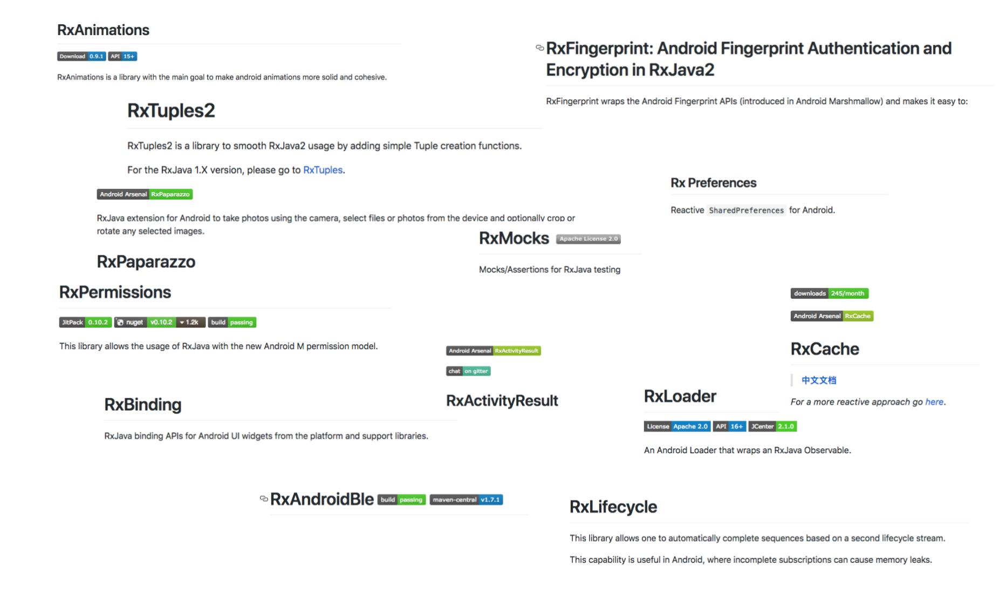

footer: @askashdavies
autoscale: true
build-lists: true
header: Open Sans
text: Open Sans
slidenumbers: true
theme: Merriweather, 3
footer-style: Open Sans


## RxJava & Coroutines
### A Practical Analysis


^ Talk a culmination of discussions with developers in conferences over last few months

^ Specifically Twitter interactions and panel discussions at Droidcon Berlin 2018

^ Most people excited about coroutines, but have questions about its usage

^ Often considered to take the place of reactive frameworks like RxJava

---

[.background-color: #ffffff]


^ Unveiled as project Kotlin in 2011 

^ Stable release in 2014, garnered support from community

---

[.background-color: #ffffff]


^ Developers celebrated as Google announced first class support for Android in 2017

^ Since then adaption has sky-rocketed, community involvement and participation

^ Talks on every aspect of Kotlin, from DataBinding to Coroutines, Redux and IoT

---


^ Study from Pusher surveyed 2744 people from January to March found Kotlin adoption doubled year on year

^ Spiking to 19.5 after the release of a document from Jake Wharton advocating its use at Square

^ Starting at 7.7%, spiking at 19.5 after JW Square document, then to 46.8 after Google IO '17

[.background-color: #ffffff]
[.footer: pusher.com/state-of-kotlin]

---

[.background-color: #ffffff]
[.footer: blog.jetbrains.com/kotlin/2016/02/kotlin-1-0-released-pragmatic-language-for-jvm-and-android/]


^ GitHub reported over 25 million LoC by the end of 2017

^ GitHub reported 2.6x grown in contributes by the end of 2018

^ Stack Overflow speculated one of the fasted growing and least disliked

^ Popularity and success contributed to by continued evolution of Kotlin

^ Understandable why people want to jump on the bandwagon

---

##  Coroutines 

^ Coroutines available as experimental in Kotlin 1.1 stable in 1.3 (Oct '18)

^ Available in other languages, subroutines for non-preemptive (cooperative) multitasking

^ Allow us to write asynchronous code as if it were synchronous

^ Not a coroutine introduction talk, assumes familiarity with coroutine

---

## ⚖️ Stability

^ In the abstract I had mentioned "with coroutines approaching stability"

^ As of Kotlin 1.3 (Oct '18) coroutines API graduated to "fully" stable

---

[.footer-style: #ffffff]


^ That wasn't completely true, but lets cover the basics

---

## @Annotations

### (🐉 Here be dragons)

^ Though coroutines are stable some API elements are still under development

^ Kotlin introduced annotations to manage these aspects

---

## Annotations

```kotlin
@ExperimentalCoroutinesApi // ⚠️
```

^ Experimental API's design declarations may still change

^ Applies to Rx conversion, and channel production

---

## Annotations

```kotlin
@ExperimentalCoroutinesApi // ⚠️

@ObsoleteCoroutinesApi // ⚠️
```

^ Obsolete API's will be deprecated in the future but not yet known what will replace them

^ Difference between obsolete and experimental is intent, @Experimental may graduate, @Obsolete unknown

^ Applies to channel consumptions, actors, Rx conversion functions

---

## Annotations

```kotlin
@ExperimentalCoroutinesApi // ⚠️

@ObsoleteCoroutinesApi // ⚠️

@InternalCoroutinesApi // ☠️
```

^ Should only be used internally by Kotlin coroutines

^ Can change without warning or migration aids

---

## 💪 Coroutines 💪

^ What makes everybody want to jump on the Coroutine bandwagon?

^ Two left arms because RTL emojis aren't a thing yet

---

## 🥇 Native first-party library

^ First class support and documentation from JetBrains

^ Continued evolution and development of performance and features

^ Not relying on a third party implementation

^ Everything already awesome about Kotlin

---

## 😊 Easy-to-use

^ Learning curve for getting started is really simple

---

## 👌 `suspend fun`

^ Create suspended methods with the suspend operations

^ Methods need not care about scheduling

---

## `Dispatchers`

^ Dispatchers provided by the framework for common use cases

^ Support for Android, JavaFX and Swing

---

## 🕰️ History of Android

^ Handling asynchronous operations on Android has been really hard

^ Java 6 and lack of lambda support made code quite ugly

---

## Background Processes

^ Too many options for background tasks make it hard for beginners

---

### Background Processes

## 🏛️️ `Runnable` / `Handler`

^ The de facto standard for Android and Java background tasks

---

### Background Processes

## 🤢 `AsyncTask`

^ Beloved AsyncTask risks memory leaks and confuses UI/background logic

---

### Background Processes

## 😕 `IntentService`

^ Intent service "work queue processor" pattern to offload tasks

---

### Background Processes

## 🍯 `Loader<T>`

^ Lifecycle aware loaders introduced in Honeycomb and compatibility library

---

### Background Processes

##  `WorkManager`

^ WorkManager released with JetPack, defers to JobScheduler, JobDispatcher or AlarmManager

^ Not even all of them, another ten in standard Android SDK

---

## 😩

^ Not even a comprehensive list, another ten native Android options

^ Decision paralysis, which is best for my project

^ AlarmManager, CountDownTimer, FutureTask, GcmNetworkManager, HandlerThread, JobDispatcher, JobScheduler, ScheduledThreadPoolExecutor, Timer, Task<T>

---

[.background-color: #ffffff]


[.footer: xkcd.com/927/]

^ No single option seems to match most requirements

^ Leading to new standards for individual use cases

---

## RxJava to the rescue


^ Allows us to compose chained operator sequences

^ Abstract away threading, synchronisation, concerns

^ Introduced the concept of reactive programming

---


## 😮 Reactive

^ This was a major turning point for architecture

^ We lost our shit, and it quickly got out of hand

---

[.background-color: #ffffff]


^ Started seeing libraries wrapping native API's

---

[.background-color: #ffffff]



^ and more

---

[.background-color: #ffffff]


^ and more

---

[.background-color: #ffffff]


^ and more

---


^ We learned that developers like readme badges

---

## 👍 Asynchronous APIs

## Synchronous APIs 👎

^ Many of these libraries do a good job of providing asynchronous API's

^ When everything uses the same framework it's easy to fit together

^ But it doesn't make sense to use a reactive framework for synchronous API's

---

[.background-color: #222222]
[.footer-style: #ffffff]


^ RxJava2 introduced four new types with no common ancestor

^ Conversion functions often hard to remember, lead to complex code

---

## 🤦‍♀️

```java
Observable
  .fromIterable(resourceDraft.getResources())
  .flatMap(resourceServiceApiClient::createUploadContainer)
  .zipWith(Observable.fromIterable(resourceDraft.getResources()), Pair::create)
  .flatMap(uploadResources())
  .toList()
  .toObservable()
  .flatMapMaybe(resourceCache.getResourceCachedItem())
  .defaultIfEmpty(Resource.getDefaultItem())
  .flatMap(postResource(resourceId, resourceDraft.getText(), currentUser, resourceDraft.getIntent()))
  .observeOn(AndroidSchedulers.mainThread())
  .subscribeOn(Schedulers.io())
  .subscribe(
      resource -> repository.setResource(resourceId, resource, provisionalResourceId),
      resourceUploadError(resourceId, resourceDraft, provisionalResourceId)
  );
```

^ Actual code sample from unnamed code base, from unnamed developer absolutely not in this room

^ How many of these operations seem unnecessary? Four flat map operations...

---

[.footer: Anchorman: The Legend of Ron Burgundy (DreamWorks Pictures)]
[.footer-style: #ffffff]


^ Well that escalated quickly...

^ Whilst chains and operators can be useful

^ They can quickly become unmanageable

---

## ⚙️ Hidden complexity

^ Business behaviour can often be hidden behind difficult to understand operators

^ Go back to previous slide, many statements feel unnecessary

---

## 😭 Hidden gotchas

^ Behaviour often unpredictable when converting from Rx2 types

^ `Maybe` can be turned to `Completable` without completing

^ Combining operators behave differently if not all complete

^ Position of `observeOn` crucial to expected behaviour

---

## 💾 Memory footprint

^ RxJava objects take a lot of memory

^ Each operation large object allocation

---

## ⤴️ Steep learning curve

^ Steep learning curve for learning operator functions

^ Even after years of use still miss some behaviours

^ Have to be an implementation expert to fully understand

---

[.footer-style: #ffffff]


^ Not the hero we wanted, or needed, or deserved.

^ Enough is enough

---

## #RxMustDie
### pca.st/7IJG


^ Discussion panel on RxJava at Droidcon Berlin

^ Started from a Twitter discussion on RxJava API

^ API obstructive, difficult, obtuse, and unnecessary

^ Podcast available via Pocket Casts

---

> "If all you have is a hammer,<br /> everything looks like a nail"
-- Abraham Maslow, The Psychology of Science, 1966

^ Previous iterations of Android limited developers

^ RxJava was the only feasible tool of choice

^ No longer the case, many tools at our disposal

---

## Coroutine Use Cases

^ Simple use cases can be achieved in Coroutines without the overhead of reactive frameworks

---

## Network Call Handling

```kotlin
// RxJava2: Single<T>
fun getUser(): Single<User> = Single.fromCallable { /* ... */ }

// Coroutines: T
suspend fun getUser(): User = /* ... */
```

^ Ignoring presence of Retrofit we return result of network request

^ Assume network retrieval with client inside comment block

^ Simply suspend network call in coroutine function

---

## Cache Retrieval

```kotlin
// RxJava2: Maybe<T>
fun getUser(): Maybe<User> = Maybe.fromCallable { /* ... */ }

// Coroutines: T?
suspend fun getUser(): User? = /* ... */
```

^ Nullable value can be returned to represent empty

---

## Background Task Handling

```kotlin
// RxJava2: Completable
fun storeUser(user: User): Completable.fromCallable { /* ... */ }

// Coroutines: Unit
suspend fun storeUser(user: User) { /* ... */ }
```

---

## Thread Handling

```kotlin
// RxJava2
getUser()
  .subscribeOn(Schedulers.io())
  .observeOn(AndroidSchedulers.mainThread())
  .subscribe { /* Do something */ }

// Coroutines
launch(Dispatchers.Main) {
  withContext(Dispatchers.IO) {
    val user = getUser()
    /* Do something */  
  }
}
```

^ Key difference is sequential operation of values

^ Imperative code much more readable

^ Value accessible instead of callback

---

## Task Cancellation

```kotlin, [.highlight: 5, 10]
// RxJava2
val disposable: Disposable = Single
    .create { /* Do something */ }
    .subscribe { /* Do something else */ }
disposable.dispose()

// Coroutine
val parent: Job = Job()
launch(Dispatchers.Main + parent) { /* Do something */ }
parent.cancelChildren()
```

^ Many times you may need to cancel a request in flight, eg. orientation change, change of input etc

^ Handled almost identically with Job, addition operator applies values right to left

^ Cancelling a job will cancel all other jobs, use cancel children or `SupervisorJob`

^ Coroutines also offers job hierarchy, jobs nested and structured, useful, but different from RxJava

---

## `ViewModel.viewModelScope`

### `androidx.lifecycle:2.1.0-alpha01`

^ Coroutine scope hierarchy allows view model scope with androidx lifecycle

^ Jobs executed will be cancelled automatically on view model clear

---

## Channels 🚇

^ Can be used to connect two coroutines, handle backpressure

^ Still marked as Obsolete, promoted to Experimental, use with care

^ Channel operations push/pull are bad for transformations

^ Not suitable as a drop in for Observables, can use instead of subjects

---

[.footer: medium.com/@elizarov/cold-flows-hot-channels-d74769805f9]


### Roman Elizarov
## Cold flows, hot channels

```kotlin
Flow.collect { 
  it.emit("Hello World!")
}
```

^ But there is hope, flow allows cold streams, some channel behaviours promoted

---

## ⚙️ RxJava: Complex Business Logic

^ Debouncing, distinct filtering, side-effects

^ Operators from RxJava intentionally not created

^ Complex business logic, merging streams, etc

^ Possible to achieve in Coroutines but arduous

^ Not going to show how to do it

---

[.footer: medium.com/capital-one-tech/coroutines-and-rxjava-an-asynchronicity-comparison-part-1-asynchronous-programming-e726a925342a]

## Asynchronicity Comparison

### Manuel Vivo (@manuelvicnt)

^ Would like to go into more detail on these comparisons

^ Focus more on feasibility, practicality, and justification

^ Multi-part blog article, great comparison of the two frameworks
 
---

## [fit] Is Coroutines a replacement for RxJava?

^ Golden question

---

### Maybe...

^ The answer isn't so clear... maybe, but not really

---

### Not really...

^ Some behaviour can be replaced, perform different functions

^ Different levels of abstraction, can complement each other

^ Even possible for RxJava to be built with Coroutines

---

## Should I migrate to Coroutines?

---

### Probably not...

^ If something is already working, it does not need to be migrated

---

> "If it ain't broke, don't fix it"
-- Bert Lance, Nation's Business, 1977

^ RxJava already provides a lot of worth for existing code

^ Coroutines perfect for new code or fresh projects

---

[.footer: © 2019 Viacom International Inc.]
[.footer-style: #ffffff]


---

## Did "you" migrate to Coroutines?

^ If you asked me if I migrated?

---

# 😜 Yes!

^ Kotlin and Coroutines are fun and a joy to use

^ Better understanding of code behaviour

^ Code often becomes much clearer

---

## How could I migrate to Coroutines?

---

## 🤝 Migration Policy

^ Agree upon a migration policy with your team

^ Start with low-level implementations

---

## Retrofit Services

---

[.footer: github.com/JakeWharton/retrofit2-kotlin-coroutines-adapter]

## [fit] Retrofit2 Coroutines Adapter 

### [fit] `com.jakewharton.retrofit:retrofit2-kotlin-coroutines-adapter:+`

^ Retrofit Coroutine adapter library from Jake Wharton

^ Not advocating dynamic versions with (+)

---

```kotlin
interface UserService {

  @GET("/user")
  fun getUser(): Deferred<User>
}

val retrofit = Retrofit.Builder()
    .baseUrl("https://example.com/")
    .addCallAdapterFactory(CoroutineCallAdapterFactory())
    .build()

GlobalScope.launch {
    val user = retrofit
        .create<UserService>() // >= 2.5.0
        .getUser()
        .await()
}
```

^ Reified type create call available from 2.5.0

---

```kotlin, [.highlight: 4, 9, 16]
interface UserService {

  @GET("/user")
  fun getUser(): Deferred<User>
}

val retrofit = Retrofit.Builder()
    .baseUrl("https://example.com/")
    .addCallAdapterFactory(CoroutineCallAdapterFactory())
    .build()

GlobalScope.launch {
    val user = retrofit
        .create<UserService>() // >= 2.5.0
        .getUser()
        .await()
}
```

^ Service should return Deferred instead of Single or Observable

^ Can also wrap Response or Result as normal

^ Use provided Coroutine call adapter factory when building retrofit client

^ Await the response of deferred type inside Coroutine context

---

[.footer: github.com/square/retrofit/pull/2886]

## Retrofit 

### First-party "suspend" support

^ Pull request on Retrofit repo from Jake Wharton

^ Anywhere between now and the end of time

---

## Coroutines RxJava2

### [fit] `org.jetbrains.kotlinx:kotlinx-coroutines-rx2:+`

^ Convert suspended functions seamlessly

^ RxJava builders provide scope to consume suspend functions

^ Allows awaiting observable streams as channels (obsolete)

---

| **Name**        | **Scope**        | **Description**
| --------------- | ---------------- | ---------------
| `rxCompletable` | `CoroutineScope` | Cold completable that starts coroutine on subscribe
| `rxMaybe`       | `CoroutineScope` | Cold maybe that starts coroutine on subscribe
| `rxSingle`      | `CoroutineScope` | Cold single that starts coroutine on subscribe
| `rxObservable`  | `ProducerScope`  | Cold observable that starts coroutine on subscribe
| `rxFlowable`    | `ProducerScope`  | Cold observable that starts coroutine on subscribe with **backpressure** support 

^ Allows easy and reliable conversion of observables and coroutines

---

```kotlin, [.highlight: 3-4]
val service: UserService = retrofit.create()  // >= 2.5.0

GlobalScope
    .rxSingle { service.getUser() }
    .observeOn(AndroidSchedulers.mainThread())
    .subscribeOn(Schedulers.io())
    .subscribe(
        { /* Do something with user */ },
        { /* Handle error ... probably */ }
    )
```

^ Take our user service from earlier, handle threading with RxJava

^ Context is an EmptyCoroutineContext, default values, inherits from scope

---

## Completable.await()

```kotlin, [.highlight: 4]
GlobalScope.launch {
  Completable
    .complete()
    .await()
}
```

^ Inversely you can convert Reactive types to simple variables with the same libary

^ Completable returns only unit, but awaiting will result in execution

---

## Maybe.await()

```kotlin, [.highlight: 4]
GlobalScope.launch {
  val result: String? = Maybe
    .fromCallable { null as String? }
    .await()

  // result == null
}
```

^ Maybe will return a nullable value with await

---

[.footer: kotlin.github.io/kotlinx.coroutines/kotlinx-coroutines-rx2/kotlinx.coroutines.rx2/io.reactivex.-observable-source/index.html]

## Observable.await...

```kotlin
val observable = Observable.just(1, 2, 3, 4)

// Await first item
val item = observable.awaitFirst()

// Print each item
observable.consumeEach(::println)

// Consume all items
observable
  .openSubscription()
  .consume {
    println(it.size)
  }
```

^ Conversely you can consume items from an observable within a Coroutine Scope

---

## Exceptions?

---

## Exceptions

```kotlin
observable.subscribe(
  onSuccess = { it: T -> },
  onError = { it: Throwable -> } // Gotta catch em all!
)

launch {
  try {
    doSomethingDangerous()
  } catch(exception: DangerousException) {
    // Specific exception caught!
  }
}
```

^ Coroutines doesn't include error handling by default

^ RxJava will catch all exceptions by default (Pokemon exceptions)

^ Recommended to manually catch expected exceptions

---

## Exceptions

```kotlin
val handler = CoroutineExceptionHandler { _, exception -> 
  println("Caught $exception") 
}

val job = GlobalScope.launch(handler) {
  throw AssertionError()
}

join(job)

// Caught java.lang.AssertionError
```

---

## 😅 Conclusion

^ Good idea of when its appropriate to use RxJava or Coroutines

^ Most of the time fine to use both, frameworks are complementary

^ Many other times you don't need complicated architecture

^ Now you have more than a hammer you can pick the right tool for the job

---


# Cheers! 🍻

## [fit] bit.ly/rxjava-coroutines-prague


^ Slides and links available online
