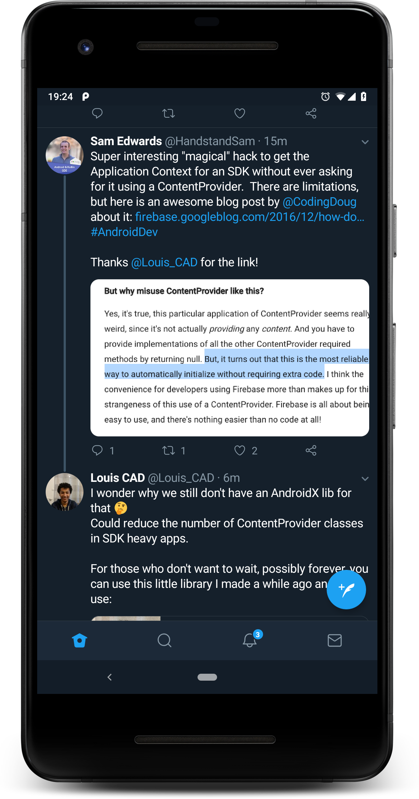

autoscale: true
build-lists: true
footer: @askashdavies
footer-style: Open Sans
header: Open Sans
slidenumbers: true
slide-transition: true
theme: Huerta, 5
text: Open Sans


## [fit] Implementing the Paging Library
### Droidcon NYC


---

[.footer: ]

   

^ Nearly all applications display lists of data

^ Surprisingly hard to find SFW screenshots

---

# ListView

```xml
<ListView
      android:id="@+id/list_view"
      android:layout_width="match_parent"
      android:layout_height="match_parent" />
```

^ From Android API 1 we had the ListView for lists

^ Displays a vertically scrollable collection of views

---

# ArrayAdapter

```kotlin
// extends BaseAdapter>

list.adapter = ArrayAdapter(
    this, 
    android.R.layout.simple_list_item_1, 
    arrayOf("Kotlin", "Java" /* ... */)
)
```

^ It was enough in most cases to use the ArrayAdapter

^ Extends BaseAdapter providing filtering comparator for Strings

---

# BaseAdapter

```kotlin
class ListAdapter : BaseAdapter() {

    override fun getView(position: Int, convertView: View, container: ViewGroup) {
        val view = convertView ?: layoutInflater.inflate(android.R.layout.simple_list_item_1, container, false)
        
        convertView
            .findViewById(android.R.id.text1)
            .text = getItem(position)
            
        return convertView
    }
}
```

^ More complex data types required extending the base adapter

^ Inflation of view and binding of types in same method

---

# BaseAdapter

```kotlin, [.highlight: 3-7, 9, 11]
class ListAdapter() : BaseAdapter() {

    var items: List<String> = emptyList()
        set(value) {
            field = value
            notifyDataSetChanged()
        }

    override fun getCount(): Int = items.size

    override fun getItem(position: Int): String = items[position]
    
    override fun getView(position: Int, convertView: View, container: ViewGroup) {
        val view = convertView ?: layoutInflater.inflate(android.R.layout.simple_list_item_1, container, false)
        
        convertView
            .findViewById(android.R.id.text1)
            .text = getItem(position)
            
        return convertView
    }
}
```

^ Additionally we would have to implement retrieval of items

^ Notification of data invalidation

---

BaseAdapter (SpinnerAdapter) / ListView

 - Manages own list
 - Inflate own view
 - notifyDataSetChanged()
 - Filterable

Filterable / notifyDataSetChanged()

---
 
RecyclerView
 
---

ListAdapter

- Takes immutable lists
- Provides animated updates
- Computes diff in background
- Released in support lib 27.1
- See also AsyncListDiffer

^ How to migrate to the ListAdapter from standard RecyclerView.Adapter

---

# ItemCallback

```kotlin
abstract class ItemCallback<T> {
    
    abstract fun areItemsTheSame(oldItem: T, newItem: T): Boolean

    abstract fun areContentsTheSame(oldItem: T, newItem: T): Boolean
}
```

^ Null assumed to be the same and not equal to not null value

^ areContentsTheSame only called if areItemsTheSame returns true for both

^ areItemsTheSame used to compare unique identifiers

---

# PagedList<T> : List<T>

- Loads data asynchronously
- Backed by a DataSource

---

# PagedList.Config

```kotlin
val config: PagedList.Config = PagedList.Config.Builder()
    .setEnablePlaceholders(true)
    .setInitialLoadSizeInt(50)
    .setPrefetchDistance(10)
    .setPageSize(20)
    .build()

val data: LiveData<PagedList<T>> = LivePagedListBuilder(factory, config)
    .build()
```

---

# Placeholders

- Users can scroll past whats loaded
- Scrollbars look correct
- Don't need loading spinner

---

# Placeholders

- Items should be same size
- Adapter must handle null items
- DataSource must count items

---

# RxJava
## RxHavaPagedListBuilder()

- `buildObservable()`
- `buildFlowable()`

---

[.footer: github.com/chrisbanes/tivi/blob/master/data-android/src/main/java/app/tivi/data/FlowPagedListBuilder.kt]

# Coroutines
## FlowPagedListBuilder()

---

# PositionalDataSource

- Able to scroll to different elements
- Load initial with start position
- Returns position with total count
- Load range with start position

---

# ItemKeyedDataSource

- List of names from `DataSource`
- Item key indicates positon
- Works well for ordered lists

---

# PageKeyedDataSource

---

# Source of truth

- Consistent data presentation
- Simple process - need more, load more
- Gracefully degrades on failure
- Optionally refresh on observe

---

# Database + Network

- Needs out of data signal from DB
- Triggers network load from DB
- Paging calls BoundaryCallback

---

## Thanks!


