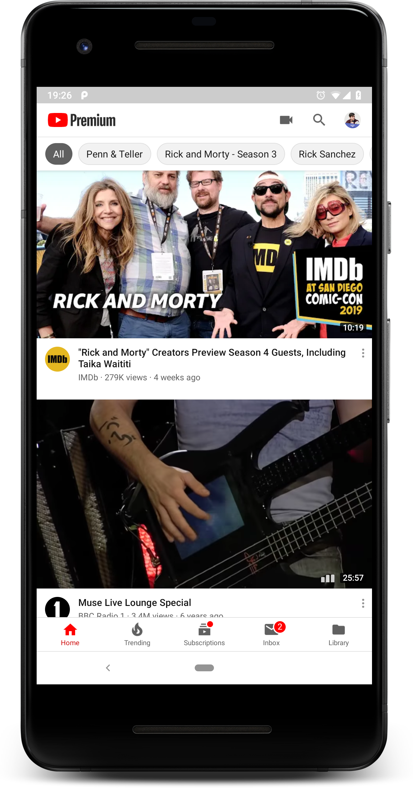
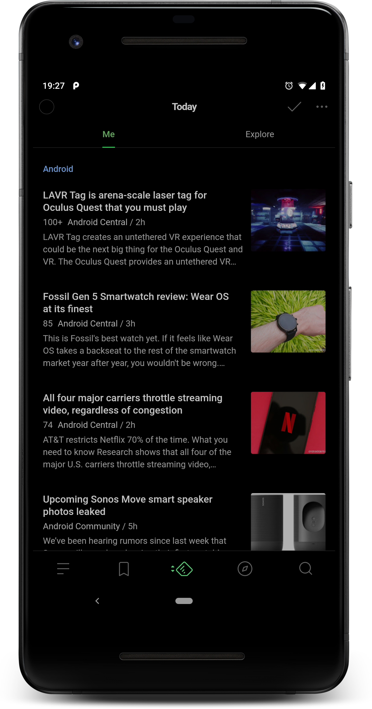
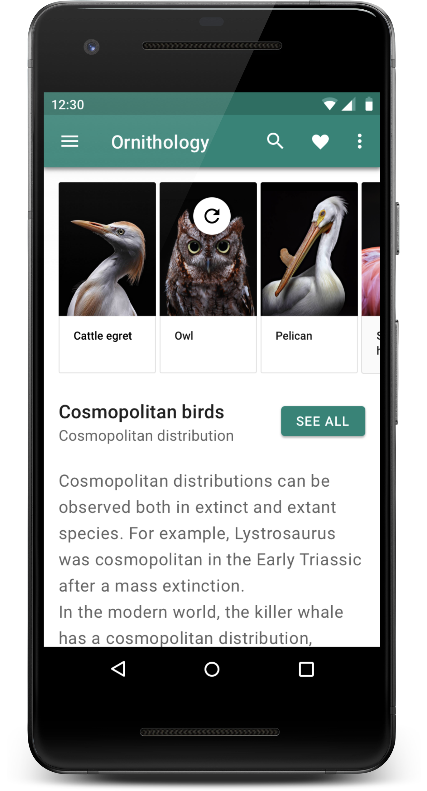

autoscale: true
build-lists: true
footer: @askashdavies
footer-style: Open Sans
header: Open Sans
slidenumbers: true
slide-transition: true
theme: Plain Jane, 3
text: Open Sans


## [fit] Implementing the Paging Library
### Droidcon NYC


---

[.footer: ]

   

^ Nearly all applications display lists of data

^ Surprisingly hard to find SFW screenshots

^ Simple concept but many hidden complexities

---

# Up-To-Date



^ Ensure that you deliver the latest content

^ Should poll for updates or push notifications

---

# Offline


^ How should your content behave when offline

---

# State


^ How to accurately represent state to users

---

[.background-color: #eae9ea]
[.text: #666666]

# Progress


^ Indicate progress and network operations

---

# 🛠 🕰

^ How could we have handled this before paging?

---

# `ListView`

```xml
<ListView
    android:id="@+id/list_view"
    android:layout_width="match_parent"
    android:layout_height="match_parent" />
```

^ From Android API 1 we had the ListView for lists

^ Displays a vertically scrollable collection of views

---

# `ArrayAdapter`

```kotlin
// extends BaseAdapter>

list.adapter = ArrayAdapter<String>(
    context, 
    R.layout.simple_list_item_1, 
    arrayOf("Kotlin", "Java" /* ... */)
)
```

^ It was enough in most cases to use the ArrayAdapter

^ Extends BaseAdapter providing filtering comparator for Strings

---

# BaseAdapter

```kotlin
class ListAdapter : BaseAdapter() {

  override fun getView(position: Int, convertView: View, container: ViewGroup) {
    val view = convertView ?: layoutInflater.inflate(
        R.layout.simple_list_item_1, 
        container, 
        false
    )
        
    convertView
        .findViewById(R.id.text1)
        .text = getItem(position)
            
    return convertView
  }
}
```

^ More complex data types required extending the base adapter

^ Inflation of view and binding of types in same method

---

# BaseAdapter

```kotlin, [.highlight: 3-7, 9, 11]
class ListAdapter() : BaseAdapter() {

  var items: List<String> = emptyList()
    set(value) {
      field = value
      notifyDataSetChanged()
    }

  override fun getCount(): Int = items.size

  override fun getItem(position: Int): String = items[position]
    
  override fun getView(position: Int, convertView: View, container: ViewGroup) {
    /* ... */
  }
}
```

^ Additionally we would have to implement retrieval of items

^ Notification of data invalidation

---

# Paging 📄

^ How would you handle infinite scrolling with a list view?

---

# Paging 📄
## OnScrollListener

^ Attach a scroll listener to listen for scroll events

^ Detect if the user has scrolled sufficiently and load data

^ Really unreliable and blindly updating data

---

# BaseAdapter / ListView

- Manages list of it's own data
- Manages view inflation and configuration
- Notify entire data set of change
- Not capable of diffing items

^ What else do we have available

---

# RecyclerView


^ Now included in AndroidX, introduced with support library in April 2015

^ Independent of Android platform, though AndroidX requires 28

^ Previous artifacts available via Maven if you're really unlucky

---

# RecyclerView


^ `RecyclerView` more advanced and flexible version of `ListView`

^ Minimal implementation, focused primarily on recycling

^ Much more efficient, doesnt have to handle extras

^ Though OnClickListener, and item dividers handled manually

^ Still managing list of items via `RecyclerView.Adapter`

---

# Paging 📄
## `AsyncListUtil` 

^ Many early paging attempts achieved with Cursor to load chunks

^ Would avoid querying on the UI thread and keep memory overhead low

^ Optimised for low memory usage, raw cursor access, struggles with large datasets

^ No way of managing data invalidation, crash if previous items removed

---

# Diffing
## `DiffUtil` / `AsyncListDiffer`

^ Unlike `ListView`, `RecyclerView` allows more granular control of item invalidation

^ Now possible to invalidate specific items, and animate adding and removing accordingly

^ `DiffUtil` and async counterpart `AsyncListDiffer` added in support library December 2016

---

[.background-color: #ffffff]
[.text: #666666]

[.footer: medium.com/skyrise/the-myers-diff-algorithm-and-kotlin-observable-properties-69dfb18541b]

# DiffUtil
## Myers Diff Algorithm


^ `DiffUtil` uses Myers diff algorithm to detect the fewest amount of changes between data sets

^ Article from Adrian Defus explaining how the Myers diff algorithm works with DiffUtil

---

# ListAdapter 📜

^ Then came the `ListAdapter` introduced to support library in February 2018

^ Just a few months before the paging library in May indicates direction of ideal architecture

^ Represents fundamental bridge in migration to using the paging library

---

# ListAdapter 📜
## Immutability 💪

^ Utilises all the existing strengths of `RecyclerView`

^ Computes diff in background with animated updates

^ Most importantly takes immutable lists

---

# ListAdapter
## `submitList(...)`

^ Achieves immutability this by taking control of the list

^ Where previously an adapter would manage the list of items

^ Allowing you to focus on binding the `ViewHolder`

---

# Migration
## [fit] `RecyclerView.Adapter<T>` -> `ListAdapter<T>`

^ Since the `ListAdapter` plays such an important role as a precursor to the paging library

^ It's generally good idea to use it wherever possible if you're not already doing so

^ How could we migrate if we're already using the `RecyclerView.Adapter` 

---

# RecyclerView.Adapter

```kotlin
class UserAdapter : RecyclerView.Adapter<UserViewHolder>() {

  private var items: List<User> = emptyList()
  
  override fun getItemCount() = items.size
  
  override fun onBindViewHolder(holder: ViewHolder, position: Int) = holder.bind(items[position])
  
  override fun onCreateViewHolder(parent: ViewGroup, viewType: Int): RecyclerView.ViewHolder { /* ... */ }
  
  fun updateList(items: List<User>) {
    val result: DiffResult = DiffUtil.calculate(DiffCallback(this.items, items))
    result.dispatchUpdatesTo(this)
  }
    
  class ViewHolder(view: View) : RecyclerView.ViewHolder(view) {
    
    fun bind(item: User) { /* ... */ }
  }
}
```

^ Naive implementation of a recycler view adapter

^ Already assuming a lot about your implementation

---

# RecyclerView.Adapter

```kotlin, [.highlight: 11-14]
class UserAdapter : RecyclerView.Adapter<UserViewHolder>() {

  private var items: List<User> = emptyList()
  
  override fun getItemCount() = items.size
  
  override fun onBindViewHolder(holder: ViewHolder, position: Int) = holder.bind(items[position])
  
  override fun onCreateViewHolder(parent: ViewGroup, viewType: Int): RecyclerView.ViewHolder { /* ... */ }
  
  fun updateList(items: List<User>) {
    val result: DiffResult = DiffUtil.calculate(UserComparator(this.items, items))
    result.dispatchUpdatesTo(this)
  }
    
  class UserViewHolder(view: View) : RecyclerView.ViewHolder(view) {
    
    fun bind(item: User) { /* ... */ }
  }
}
```

^ Already using `DiffUtil` to dispatch updates on updating list

---

# DiffUtil.Callback

```kotlin
class UserComparator(
    private val oldItems: List<User>, 
    private val newItems: List<User>
) : DiffUtil.Callback() {

  override fun getOldListSize(): Int = oldItems.size

  override fun getNewListSize(): Int = newItems.size
  
  override fun areItemsTheSame(oldItemPosition: Int, newItemPosition: Int): Boolean {
    return oldItems[oldItemPosition].id == newItems[newItemPosition].id
  }

  override fun areContentsTheSame(oldItemPosition: Int, newItemPosition: Int): Boolean {
    return oldItems[oldItemPosition] == newItems[newItemPosition]
  }
}
```

^ Our `DiffUtil` callback might look like this

^ Returning the size of our item sets

^ Comparing items, and contents

---

# DiffUtil.ItemCallback<User>

```kotlin
object UserComparator : DiffUtil.ItemCallback<User>() {

  override fun areItemsTheSame(oldItem: User, newItem: User): Boolean {
    return oldItem.id == newItem.id
  }

  override fun areContentsTheSame(oldItem: User, newItem: User): Boolean {
    return oldItem == newItem
  }
}
```

^ Item callback allows us to drop the instance and use an object

^ Performing only the two operations, comparing items, and contents

^ Here we're instructing the adapter the equality of items

^ So that it can apply the algorithm to accurately calculate the diff

^ Give us the buttery smooth animations our users love so much

---

# DiffUtil.ItemCallback<User>

```kotlin, [.highlight: 4, 8]
object UserComparator : DiffUtil.ItemCallback<User>() {

  override fun areItemsTheSame(oldItem: User, newItem: User): Boolean {
    return oldItem.id == newItem.id
  }

  override fun areContentsTheSame(oldItem: User, newItem: User): Boolean {
    return oldItem == newItem
  }
}
```

^ Null assumed to be the same and not equal to not null value

^ `areContentsTheSame` only called if areItemsTheSame returns true for both

^ `areItemsTheSame` used to compare unique identifiers

---

# RecyclerView.Adapter

```kotlin
class UserAdapter : RecyclerView.Adapter<UserViewHolder>() {

  private var items: List<User> = emptyList()
  
  override fun getItemCount() = items.size
  
  override fun onBindViewHolder(holder: ViewHolder, position: Int) = holder.bind(items[position])
  
  override fun onCreateViewHolder(parent: ViewGroup, viewType: Int): RecyclerView.ViewHolder { /* ... */ }
  
  fun updateList(items: List<User>) { /* ... */ }
   
  class UserViewHolder(view: View) : RecyclerView.ViewHolder(view) {
    
    fun bind(item: User) { /* ... */ }
  }
}
```

^ Now that we've migrated out comparator callback lets revisit our `RecyclerView`

---

# ListAdapter

```kotlin, [.highlight: 1]
class UserAdapter : ListAdapter<User, UserViewHolder>(UserComparator) {

  private var items: List<User> = emptyList()
  
  override fun getItemCount() = items.size
  
  override fun onBindViewHolder(holder: ViewHolder, position: Int) = holder.bind(items[position])
  
  override fun onCreateViewHolder(parent: ViewGroup, viewType: Int): RecyclerView.ViewHolder { /* ... */ }
  
  fun updateList(items: List<User>) { /* ... */ }
   
  class ViewHolder(view: View) : RecyclerView.ViewHolder(view) {
    
    fun bind(item: User) { /* ... */ }
  }
}
```

^ Changing the adapter to extend the list adapter with the type and view holder

^ Making sure to pas in our diff util callback to the adapter

---

# ListAdapter

```kotlin
class UserAdapter : ListAdapter<User, UserViewHolder>(UserComparator) {

  override fun onBindViewHolder(holder: ViewHolder, position: Int) = holder.bind(items[position])
  
  override fun onCreateViewHolder(parent: ViewGroup, viewType: Int): RecyclerView.ViewHolder { /* ... */ }
  
  class ViewHolder(view: View) : RecyclerView.ViewHolder(view) {
    
    fun bind(item: User) { /* ... */ }
  }
}
```

^ We can now drop the item management from the adapter handled by `ListAdapter`

^ Implementation much simpler and more lightweight

^ Allowing the `ListAdapter` to do the heavy lifting

---

# ListAdapter 💪

^ It already makes a lot of sense to use `ListAdapter` wherever possible

^ Migration is fairly straightforward from existing `RecyclerView.Adapter`'s

^ Makes moving to the paging library much simpler

---


^ Lets quickly review JetPack and the paging library

^ Last year Google introduced us to Android JetPack

^ Dedicated to helping us bootstrap Android development

^ Opinionated and clean implementations for common problems

---

[.background-color: #ffffff]
[.text: #666666]

# Android JetPack
## Foundation Components


^ Foundation picking up where the support library left off

^ Including ktx helpers, multidexing, and security

---

[.background-color: #ffffff]
[.text: #666666]

# Android JetPack
## Architecture Components


^ Architecture components like LiveData and ViewModel

^ Navigation, paging, and room persistence

---

[.background-color: #ffffff]
[.text: #666666]

# Android JetPack 
## Behaviour Components


^ Media playback, notifications, permissions, and slices

---

[.background-color: #ffffff]
[.text: #666666]

# Android JetPack
## UI Components


^ Finally UI, including Fragments, Transitions, Animations, and Emoji

---

# Android JetPack
## Paging 


^ Introducing JetPack

^ JetPack is...

---

## Android JetPack: Paging 

- DataSource ⛲️
- PagedList 📑
- PagedListAdapter ⚙️

^ Like many of the JetPack components, paging built from three fundamental parts

^ `DataSource` base class for loading data with relevant subclasses

^ `PagedList` implements list to manage loading of data from `DataSource`

^ Finally `PagedListAdapter` to present loaded data and manage diffing

---

# Paging ❤ Room

---

# PagedList<T> : List<T>

- Loads data asynchronously
- Backed by a DataSource

---

# PagedList.Config

```kotlin
val config: PagedList.Config = PagedList.Config.Builder()
    .setEnablePlaceholders(true)
    .setInitialLoadSizeInt(50)
    .setPrefetchDistance(10)
    .setPageSize(20)
    .build()

val data: LiveData<PagedList<T>> = LivePagedListBuilder(factory, config)
    .build()
```

---

# Placeholders

- Users can scroll past whats loaded
- Scrollbars look correct
- Don't need loading spinner

---

# Placeholders

- Items should be same size
- Adapter must handle null items
- DataSource must count items

---

# RxJava
## RxHavaPagedListBuilder()

- `buildObservable()`
- `buildFlowable()`

---

[.footer: github.com/chrisbanes/tivi/blob/master/data-android/src/main/java/app/tivi/data/FlowPagedListBuilder.kt]

# Coroutines
## FlowPagedListBuilder()

---

# PositionalDataSource

- Able to scroll to different elements
- Load initial with start position
- Returns position with total count
- Load range with start position

---

# ItemKeyedDataSource

- List of names from `DataSource`
- Item key indicates positon
- Works well for ordered lists

---

# PageKeyedDataSource

---

# Source of truth

- Consistent data presentation
- Simple process - need more, load more
- Gracefully degrades on failure
- Optionally refresh on observe

---

# Database + Network

- Needs out of data signal from DB
- Triggers network load from DB
- Paging calls BoundaryCallback

---

## Thanks!


