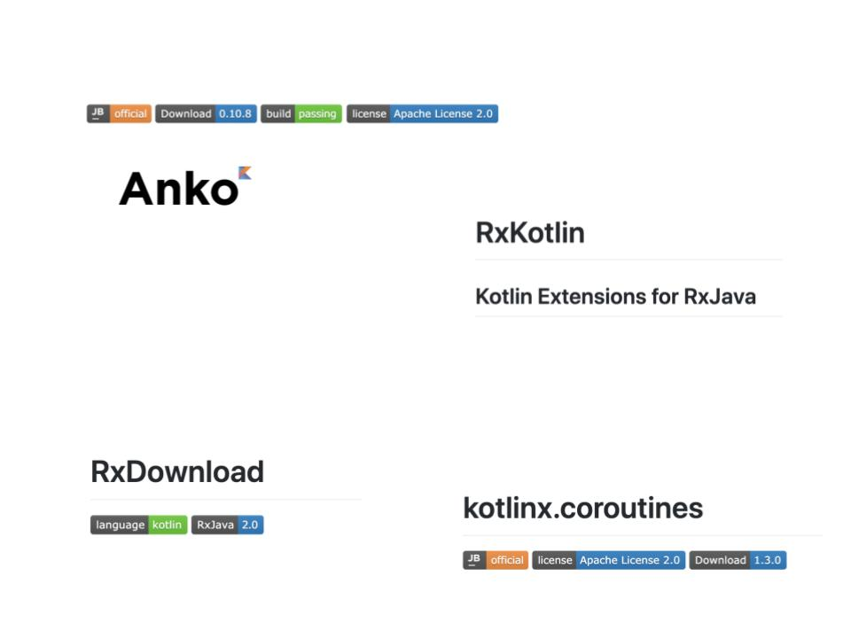
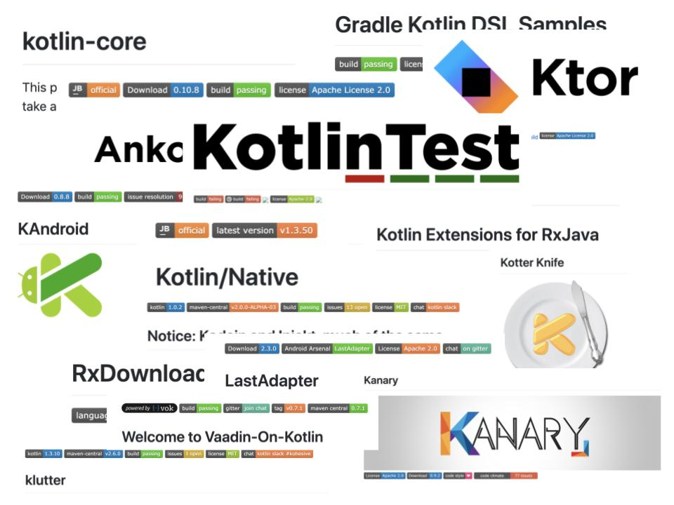

autoscale: true
build-lists: true
footer: @askashdavies
footer-style: Open Sans
header: Google Sans
slide-transition: true
theme: Simple, 3
text: Open Sans

## [fit] Refactoring Legacy Code with Kotlin
### Kotlin Everywhere: Hamburg

---

## [fit] How to prepare a talk in under 24 hours ⏰
### Kotlin Everywhere: Hamburg

---

# Java 

^ Though Android is built upon Java

^ Java has never really been available to us

---

# { }

^ Lambdas representing only a small set of Java 8 features

^ Not available until recent AGP v3.0.0

---

# Streams ↝ 

^ Not available until Android Nougat

^ Not able to raise min sdk

---

^ But so what? Backend developers can use whatever version they like

---

# Kotlin 

^ Many arguments for Kotlin of Java

^ Code that looks familiar

^ Code that behaves idiomatically

^ Code that looks concise

^ Aggressive development

---

# Null 💵

^ The million dollar mistake

^ Null has plagued developers for years

^ Null checks present in nearly all Java code

^ Unexpected behaviour, unpredictable output

---

# Offensive Code <🖕>

^ Offensive code is similar to defensive in a way

^ Does not tolerate errors in the wrong places

^ If you've ever inspected an Rx stack trace...

^ Point of failure much easier to find and detect

---

# Urgency 🚨

^ Bugs treated as fatal demand immediate attention

^ Sounds bad but results in finding bugs much quicker

^ Codebase much less error prone

---

# Kotlin?

^ So should we all start using Kotlin?
 
--- 

# Kotlin 💪

^ Yes! What are you listening to me for?
 
^ Go, start coding!

---

[.background-color: #ffffff]

^ What did that mean for our green robot friend?

---

# Google IO 2018 🥇

^ In Google IO 2018 Google announced first class support for Koltin

---

# 🎉 👼 😊

^ Heavens opened, angels sang, prayers were answers

^ Developers worldwide wept for joy

^ Their prayers had been answered

---

# Google IO 2019 🥇 🎖

^ Furthermore in Google IO 2019

^ Google announced that Kotlin was the preferred language

---

# Kotlin 

^ This was a major turning point for architecture

^ We lost our shit, and it quickly got out of hand

---

# Libraries

^ We started seeing libraries for every different type 

---

[.background-color: #ffffff]

^ We started producing Kotlin libraries

---

[.background-color: #ffffff]

^ And more

---

[.background-color: #ffffff]

^ And more

---

[.background-color: #ffffff]

^ And more

---

[.background-color: #ffffff]

^ One the plus side we learned that people really like readme badges

---

^ Its ok, it was the same with Rx, people adopting Kotlin

---

# Kotlin 🤔
 
^ What makes Kotlin so elusive

---

# Idiomacy

---

^ Not to be confused with the 2006 film Idiocracy

---

# Idiomatic Code

---

# Idiomatic Code

- Consistent, easier to read
- Less cognitive load
- Less ambiguity
- Function > Style

^ - Less ambiguity for new contributors

^ - Time better spent reviewing code for functionality rather than style.

---

# Code Style

- kotlinlang.org/docs/reference/coding-conventions.html

- android.github.io/kotlin-guides/style.html

^ Android and Jetbrains both define a common code style

---

## Thanks!

