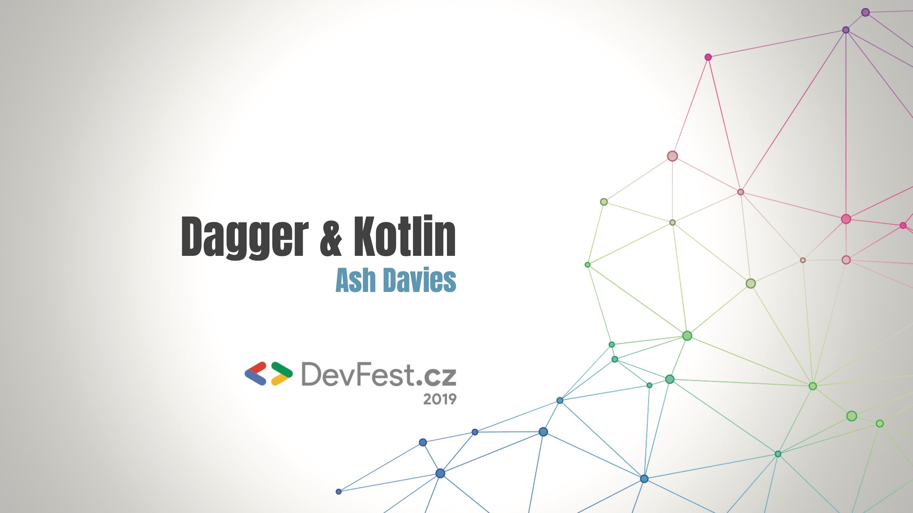
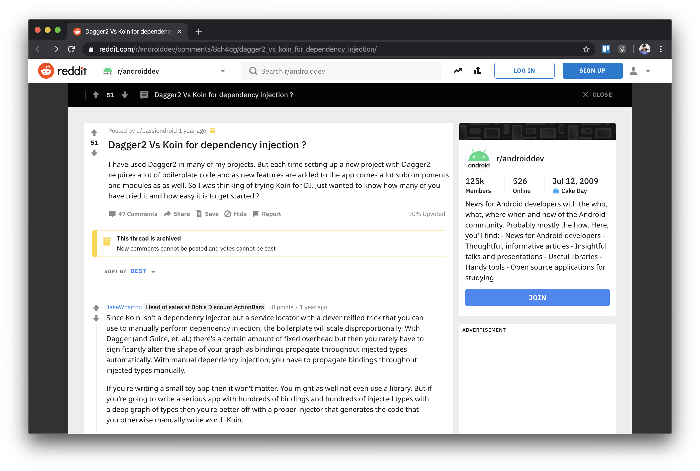
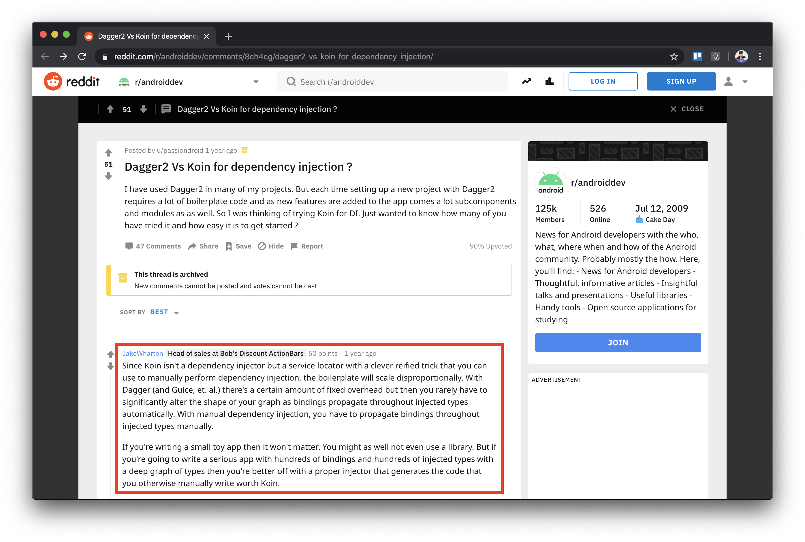
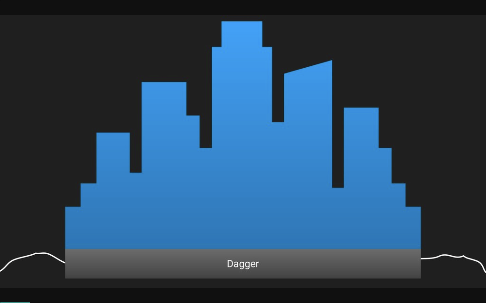
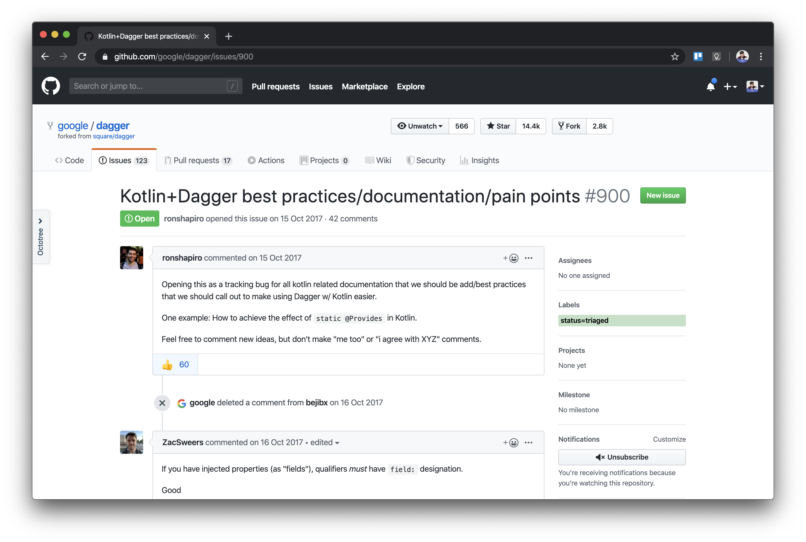
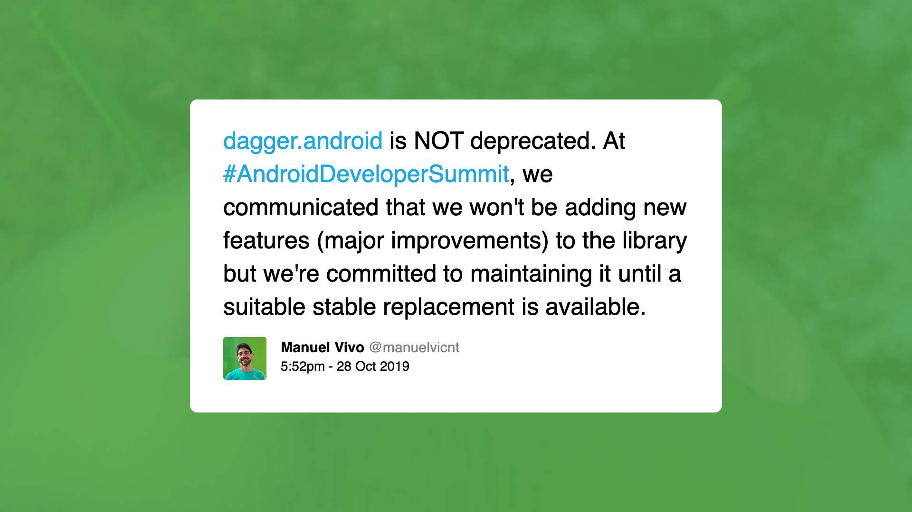

autoscale: true
build-lists: true
footer:  askashdavies
footer-style: Anton
header: Anton
slide-transition: true
text: Anton
theme: Plex, 1



^ Speaker introduction

^ Thank you for coming to my talk on bad jokes, memes, and dated internet humour.

^ Who knows dependency inversion/injection?

---

# What is dependency injection? 🤔

---

[.footer: developer.android.com/training/dependency-injection]

# Dependency Injection

```kotlin
class Car {
  
  private val engine = Engine()

  fun start() {
    engine.start()
  }
}

fun main(args: Array) {
  val car = Car()
  car.start()
}
```

^ Lets take a thermosiphon that implements pump

^ If the heater is hot it pumps

^ How could we test this class

---

[.footer: developer.android.com/training/dependency-injection]

# Dependency Injection

```kotlin, [.highlight: 3]
class Car {
  
  private val engine = Engine()

  fun start() {
    engine.start()
  }
}

fun main(args: Array) {
  val car = Car()
  car.start()
}
```

^ If electric heater performs a blocking operation it becomes difficult to test

^ What if we wanted to reuse the implementation with a different type of heater?

---

[.footer: developer.android.com/training/dependency-injection]

# Dependency Injection

```kotlin, [.highlight: 1, 9-10]
class Car(private val engine: Engine) {

  fun start() {
    engine.start()
  }
}

fun main(args: Array) {
  val engine = Engine()
  val car = Car(engine)
  car.start()
}
```

^ By moving this value to the constructor you provide the class with its dependency

^ Dependencies being "injected" through the constructor allow testability

---

# Wtf 🤷‍♀️

> Dagger sounds confusing, I'll just use something else

^ Many people react to Dagger with confusion

^ Opt to use alternative methods such as Koin

---



^ Led to the question on Reddit comparing two popular frameworks

---



^ Uh oh

---

[.background-color: #000000]
[.footer: ]


^ If the head of sales at bobs discount action bars does not approve?

---

[.footer: developer.android.com/training/dependency-injection]

# Service Locator

```kotlin
object ServiceLocator {
  
  fun getEngine(): Engine = Engine()
}

class Car {

  private val engine = ServiceLocator.getEngine()

  fun start() {
    engine.start()
  }
}
```

^ How is a service locator different from dependency injection

^ Dependencies are retrieved from container instead of provided

^ Fine for small projects, home rolled, but doesn't scale well

---

# What is Dagger 🗡

- Dependency injection implementation

- Generates code for injection

- Compile time - sans reflection

^ Dagger 2 is a dependency injector for Android and Java

^ Compile time safety through code generation

---

# In Java

^ Written purely in Java

---

# In Java, for Java

^ For Java applications

---

# In Java, for Java, by Java

^ Generating Java code

---

# In Java, for Java, by Java, with Java developers

^ Designed by Java developers

---

# In Java, for Java, by Java, with Java developers, for Ja....

^ You get the idea

---

# Java ☕️

---

[.footer: HBO]


^ Wait what?

^ What is code generation

---

# Code Generation 📠

^ It's important to understand what code generation is

^ Code generation is based upon annotation processors

^ Annotation processors process annotated class and generate new code

---

# AutoValue ⚙️
 
^ This is how auto value works prior to the data classes of Kotlin

^ Evaluates the properties of existing Java classes

---

# Lombok 🧙‍♀️

^ Other methods like Lombok use byte weaving to modify existing byte code

^ Fucking voodoo, stay the hell away

---

# Dagger 🗡

^ Lets get back to Dagger before I lead you off on a tangent

---

[.footer: jakewharton.com/helping-dagger-help-you/]



^ Great few opening slides from Jake on using Dagger for scalability

^ Dagger helps us by generating the code for reliable dependency injection

^ Code generated is the same as code you would write yourself

---

# History 🧓

^ Not exactly the new kid on the block

^ Dagger has been through a few iterations and has a long history

---

# Guice 🥤
#### (Pronounced 'juice')

^ Origins in Guice developed by Google

^ Around for a very long time still under active development

---

# Dagger 
#### (JSR-330)

^ Square built Dagger, influenced by Guice, but not extended

^ Build on the JSR-330 standard introduces DI for Android

---

[.footer: youtube.com/watch?v=oK_XtfXPkqw]

# Dagger 2 
#### (Sans-Reflection)

^ Forked and extended by the big G, brought back into the fold

^ Efforts to remove reflection through code generation

^ Improved performance for Android

^ Talk from Greg Kick explaining the improvements

---

# Kotlin 
#### (noun: freakin' awesome)

^ Created in 2011 project Kotlin, stable release 2014

---

# Dagger 2 🗡
## Kotlin ♥

^ Dagger *can* work with Kotlin but it's generated in Java

^ Relies upon Kotlin interoperability to function

^ Kotlin compatiblity has already begun

---

# Dagger Qualifiers

Qualifiers used to identify dependencies with identical signatures

^ If there are multiple different instance of same class/interface in graph

^ Passing String, Int or similar type into Graph will work for first one

^ it fails when there are multiple provider for type

^ Create your own or use provided Named annotation

---

# Retention Annotation

Use Kotlin retention annotations instead of Java retention

^ Use RUNTIME retention since Dagger doesn't operate on source files

^ Determines whether an annotation is stored in binary output and visible for reflection

---

# Constructor injection

```kotlin
class Game @Inject constructor(
    @Named("P1") private val player1: Player,
    @Named("P2") private val player2: Player
)
```

^ Simple Game class with Injected construtor

^ We have named player instance in dagger graph

---

# Constructor injection

```java
public final class Game {
   private final Player player1;
   private final Player player2;

   @Inject public Game(
     @Named("P1") Player player1,
     @Named("P2") Player player2) {
      super();
      this.player1 = player1;
      this.player2 = player2;
   }
}
```

^ Decompiled version of Kotlin class (Simplified)

^ But those annotations? How do they affect the compiled code?

---

# Constructor Injection

```java, [.highlight: 6-7]
public final class Game {
   private final Player player1;
   private final Player player2;

   @Inject public Game(
     @Named("P1") Player player1,
     @Named("P2") Player player2) {
      super();
      this.player1 = player1;
      this.player2 = player2;
   }
}
```

^ named annotations are at the place dagger needs

---


^ Before we continue I should warn you that things have changed

---


^ Even if the content changes by the time you finish preparing it

^ You should still give your talk!

---



^ The Dagger team are continuously developing Android and Kotlin support

^ I will let you know where the content has changed

---


# Field Injection: lateinit var 🛑

```kotlin
class Game @Inject constructor() {

  @Inject @Named("P1") lateinit var player1: Player
  @Inject @Named("P2") lateinit var player2: Player
}
```

^ What about field property injections

^ But kotlin properties arent same as Java properties

---

# Decompiled lateinit var

```java
public final class Game {
   @Inject public Player player1;
   @Inject public Player player2;

   @Named("P1") public static void player1$annotations() {}

   public final Player getPlayer1() { ... }

   public final void setPlayer1(Player var1) {...}

   @Named("P2") public static void player2$annotations() {}

   public final Player getPlayer2() { ... }

   public final void setPlayer2(Player var1) {...}
```

^ Simplified

^ @Named annotations are applied on additional static methods

^ property access syntax via accessors

^ Dagger processor will fail; it cannot know which player to inject

---

# Decompiled lateinit var

```java, [.highlight: 2-3, 5, 11]
public final class Game {
   @Inject public Player player1;
   @Inject public Player player2;

   @Named("P1") public static void player1$annotations() {}

   public final Player getPlayer1() { ... }

   public final void setPlayer1(Player var1) {...}

   @Named("P2") public static void player2$annotations() {}

   public final Player getPlayer2() { ... }

   public final void setPlayer2(Player var1) {...}
```

^ This happens because Inject is Target annotation but Named is Qualifier annotation

^ Doesnt look right

---

# Specify Annotations

- @field:...
- @set:...
- @get:...
- @param:...
- @property:...
- @setparam:...
- @receiver:...
- @delegete:...

^ We need to specify where annotation apply in Java world

^ They can have many different targets

---


---

# Specify Annotations

```kotlin
class Game @Inject constructor() {

  @Inject @field:Named("P1") lateinit var player1: Player
  @Inject @field:Named("P2") lateinit var player2: Player
}
```

^ Adding the specifier on the annotation

---

# Specify Annotations

```java
public final class Game {

   @Inject @Named("P1") public Player player1;
   @Inject @Named("P2") public Player player2;

   public final Player getPlayer1() {...}

   public final void setPlayer1(Player var1) {...}

   public final Player getPlayer2() {...}

   public final void setPlayer2(Player var1) {...}
}
```

^ Now the field is correctly annotated

---

# Constructor vs Property injection
## Constructor injection

- Immutable 💪
- Easy to use 😅
- Reliable injection 🧱
- Compilation safety 🛠

---

# Constructor vs Property injection
## Property injection

- Mutable (lateinit) properties 💔
- Annotation target unclear 🤷‍♂️
- Difficult to configure tests 📐

^ lateinit var is error prone and hacky to test

^ Constructor injection is much clearer

---

# Property injection

^ But why have property injection if we constructor is better?

---


^ Thats because of our little green friend

---

# Android

- Activity
- Fragment
- Service

^ For now android framework types need to be created by Android

^ Meaning classes need to have a no-arg constructor

^ More details on this later

---

# Scope Annotations 🎯

---

# @Scope 🎯

```java
@Documented
@Retention(RetentionPolicy.RUNTIME)
@Target(ElementType.ANNOTATION_TYPE)
public @interface Scope {
}
```

^ Scope is a meta annotation applied to other annotations

^ Scope indicates a lifecycle for the dependency

^ Dagger will ensure the same instance provided

---

# @Singleton

^ Most commonly used annotation is Singleton

^ Also serves as documentation to developers

---

# @Singleton != Singleton Pattern

^ Important to remember the singleton is not the same as the singleton pattern

---

# @Singleton != Singleton Pattern

```java
public final class Singleton {
    
    private static final Singleton INSTANCE = new Singleton();
    
    private Singleton() {
    }
    
    public static Singleton getInstance() {
        return INSTANCE;
    }
}
```

^ Singleton classes created statically when the class is loaded

^ Same instance for the entire application

^ Lifecycle impossible to manage

---

# @Singleton != Singleton Pattern

```kotlin
object Singleton
```

^ Same behaviour demonstrated by Kotlin objects

^ Much less code

---

# @Scope

```kotlin
@Scope
@MustBeDocumented
@Retention(AnnotationRetention.RUNTIME)
annotation class ActivityScope
```

^ Create a Kotlin scope annotation using the @Scope annotation

^ Use @MustBeDocumented instead of @Documented

^ Like @Qualifier should use Binary or Runtime retention

^ Runtime retention visible during reflection

---

# @Scope

```kotlin
@Module
internal object ApplicationModule {

    @Provides
    @ActivityScope
    fun context(application: Application): Context = application
}
```

^ Apply scope annotations to your module provisions

^ Instance of dependency will live as long as your component

---

# @ActivityScope 🤷‍♂️😏

^ Dagger does not care about the semantic meaning of your scope

---

# @Scope 🙅‍♂️

```kotlin
@ActivityScope // Don't do this!
class ActivityRepository @Inject constructor() {
}
```

^ Dont apply scope annotations to your implementation

^ Results in implementation dictating it's own lifecycle

^ Confuses the why and the how of implementation details

---

# @Reusable

^ Unlike singleton instructs Dagger that the instance can be reused

^ Should be used for expensive instantiations

^ Uses a single check algorithm

---

# Double Check

```java
public final class DoubleCheck<T> implements Provider<T>, Lazy<T> {
  private static final Object UNINITIALIZED = new Object();

  private volatile Provider<T> provider;
  private volatile Object instance = UNINITIALIZED;

  private DoubleCheck(Provider<T> provider) { /* ... */ }

  @Override
  public T get() {
    Object result = instance;
    if (result == UNINITIALIZED) {
      synchronized (this) {
        result = instance;
        if (result == UNINITIALIZED) {
          result = provider.get();
          instance = reentrantCheck(instance, result);
          provider = null;
        }
      }
    }
    return (T) result;
  }

  public static Object reentrantCheck(Object currentInstance, Object newInstance) { /* ... */ }
}
```

---

# Double Check

```java, [.highlight: 13-19, 24]
public final class DoubleCheck<T> implements Provider<T>, Lazy<T> {
  private static final Object UNINITIALIZED = new Object();

  private volatile Provider<T> provider;
  private volatile Object instance = UNINITIALIZED;

  private DoubleCheck(Provider<T> provider) { /* ... */ }

  @Override
  public T get() {
    Object result = instance;
    if (result == UNINITIALIZED) {
      synchronized (this) {
        result = instance;
        if (result == UNINITIALIZED) {
          result = provider.get();
          instance = reentrantCheck(instance, result);
          provider = null;
        }
      }
    }
    return (T) result;
  }

  public static Object reentrantCheck(Object currentInstance, Object newInstance) { /* ... */ }
}
```

^ Performs a double check outside and inside a synchronised block

^ Expensive operation should really be avoided

---

# Single Check

```java, [.highlight: 11-12, 17, 22]
public final class SingleCheck<T> implements Provider<T> {
  private static final Object UNINITIALIZED = new Object();

  private volatile Provider<T> provider;
  private volatile Object instance = UNINITIALIZED;

  private SingleCheck(Provider<T> provider) { /* ... */ }

  @Override
  public T get() {
    Object local = instance;
    if (local == UNINITIALIZED) {
      Provider<T> providerReference = provider;
      if (providerReference == null) {
        local = instance;
      } else {
        local = providerReference.get();
        instance = local;
        provider = null;
      }
    }
    return (T) local;
  }
}
```

^ Single check algorithm has much better performance

---

# Kotlin: Lazy

```kotlin
private val viewModel by lazy(NONE) { SampleViewModel() }

fun <T> lazy(mode: LazyThreadSafetyMode, initializer: () -> T): Lazy<T> =
    when (mode) {
        LazyThreadSafetyMode.SYNCHRONIZED -> SynchronizedLazyImpl(initializer)
        LazyThreadSafetyMode.PUBLICATION -> SafePublicationLazyImpl(initializer)
        LazyThreadSafetyMode.NONE -> UnsafeLazyImpl(initializer)
    }
```

^ Much the same as how Kotlin handles lazy property delegates

^ Recommended to use lazy(NONE) wherever possible

^ Especially in single thread environments like Android

---

# [fit] Favour @Reusable over @Scope 👍

- Great for expensive dependencies

- Work great in single thread environments

- Not guaranteed same instance in multiple threads

- Prefer to keep your Dagger graph stateless

- Use @Scope if you absolutely need to store state

^ Ideally your Dagger graph shouldn't contain state

^ Allow your injection sites to store the instance

^ Lifecycle managed by injection site

---

# Dagger: Modules

---

# Status Quo 🎸

```java
@Module
public abstract class ApplicationModule {
    
    @Binds
    abstract Context context(Application application);
    
    @Provides
    static SampleRepository repository(String name) {
        return new SampleRepository(name);
    }
}
```

^ The current status quo for Java modules

^ allows us to define both @Binds and @Provides

^ Dagger need not instantiate this module to create dependencies

^ @Binds informs the Dagger compiler to create a synthetic binding

^ @Provides results in a static function

---

# Dagger: Modules

```kotlin
@Module
abstract class ApplicationModule {

    @Binds
    abstract fun context(application: Application): Context
    
    @Module
    companion object {
    
        @Provides
        @JvmStatic
        fun repository(name: String): SampleRepository = SampleRepository(name)
    }
}
```

^ Converting this code to Kotlin results in a companion object for the static functions

---

# Dagger: Modules

```java
public abstract class ApplicationModule {
   public static final ApplicationModule.Companion Companion = new ApplicationModule.Companion();

   @Binds
   @NotNull
   public abstract Context context(@NotNull Application var1);

   @Provides
   @JvmStatic
   @NotNull
   public static final SampleRepository repository(@NotNull String name) {
      return Companion.repository(name);
   }

   @Module
   public static final class Companion {
      @Provides
      @JvmStatic
      @NotNull
      public final SampleRepository repository(@NotNull String name) {
         return new SampleRepository(name);
      }

      private Companion() {
      }
   }
}
```

^ Generates twice the methods as are necessary

^ Companion object instantiated statically anyway

^ Can mangle names when using multi-bindings

---

# Dagger: Modules

```kotlin
object ApplicationModule {

    @Provides
    @JvmStatic
    fun context(application: Application): Context = application
    
    @Provides
    @JvmStatic
    fun repository(name: String): SampleRepository = SampleRepository(name)
}
```

^ Use top-level Kotlin objects to reduce the generated code

---

# Dagger: Modules

```java
public final class ApplicationModule {
   public static final ApplicationModule INSTANCE = new ApplicationModule();

   @Provides
   @JvmStatic
   @NotNull
   public static final Context context(@NotNull Application application) {
      return (Context)application;
   }

   @Provides
   @JvmStatic
   @NotNull
   public static final SampleRepository repository(@NotNull String name) {
      return new SampleRepository(name);
   }

   private ApplicationModule() {
   }
}
```

^ Still creates instance of object module

^ But no duplicate method signatures

^ Module is stateless

---

# Dagger: Modules

```kotlin
@file:JvmName("ApplicationModule")
@file:Module

@Provides
fun context(application: Application): Context = application

@Provides
fun repository(name: String): SampleRepository = SampleRepository(name)
```

^ Interestingly you can use top-level Kotlin methods with Jvm annotations

---

# Dagger: Modules

```java
public final class ApplicationModule {

   @Provides
   @NotNull
   public static final Context context(@NotNull Application application) {
      return (Context)application;
   }

   @Provides
   @NotNull
   public static final SampleRepository repository(@NotNull String name) {
      return new SampleRepository(name);
   }
}
```

^ This will generate a simple Java classes with static methods

^ But as it's not a defined class, cannot be referenced from Kotlin

---

[.footer: ]


---

# But wait...

---

# Dagger 2.25.2 🎉🥳

## Kotlin support

- Qualifier annotations on fields can now be understood without the need for @field:MyQualifier (646e033)
- @Module object classes no longer need @JvmStatic on the provides methods. (0da2180)

---


^ Forget everything I just told you

---

# Qualifier annotations

```kotlin
class Game @Inject constructor() {

  @Inject @field:Named("P1") lateinit var player1: Player
  @Inject @field:Named("P2") lateinit var player2: Player
}
```

^ Remember our qualified fields?
^ Forget everything I just told you

---

# Qualifier annotations

```kotlin, [.highlight: 3-4]
class Game @Inject constructor() {

  @Inject @Named("P1") lateinit var player1: Player
  @Inject @Named("P2") lateinit var player2: Player
}
```

^ Remember our qualified fields?

---

# Dagger: Modules

```kotlin
object ApplicationModule {

    @Provides
    @JvmStatic
    fun context(application: Application): Context = application
    
    @Provides
    @JvmStatic
    fun repository(name: String): SampleRepository = SampleRepository(name)
}
```

^ and remember that Kotlin module I told you about

---

# Dagger: Modules

```kotlin
object ApplicationModule {

    @Provides
    fun context(application: Application): Context = application
    
    @Provides
    fun repository(name: String): SampleRepository = SampleRepository(name)
}
```

---

# 🎉

---

# Kotlin: Generics<? : T>

^ Lat's celebrate this by learning about generics!

---

[.footer: ]


---

# Kotlin: Generics<? : T>

---

# Kotlin: Generics<? : T>

## Java Interoperability

^ Complicated part of Java interoperability is wildcards

^ Since Kotlin does not actually have wildcards

^ Uses declaration-site variance and type projections

---

# Kotlin: Generics<? : T>

## Java Interoperability

```java
interface Collection<E> extends Iterable<E> {
    
  boolean addAll(Collection<? extends E> collection);
}
```

^ Consider the collection interface in Java

^ Why does Java need to use a wildcard here?

---

# Kotlin: Generics<? : T>

## Java Interoperability

```java
interface Collection<E> extends Iterable<E> {
    
  boolean addAll(Collection<E> collection);
}
```

^ Could we just use addAll without a wildcard?

^ No because generic types in Java are invariant

^ What does this mean?

---

# Kotlin: Generics<? : T>

## Java Interoperability

`List<String> : List<Object>`

---

# Kotlin: Generics<? : T>

## Java Interoperability

~~`List<String> : List<Object>`~~

^ List of Strings is not a subtype of a List of Objects

^ If it were you could do the following

---

# Kotlin: Generics<? : T>

## Java Interoperability

```java
List<String> strings = new ArrayList<String>();
List<Object> objs = strings; 
objs.add(1);
String string = strings.get(0); 
```

^ Java prohibits casting a List<String> to a List<Object>

---

# Kotlin: Generics<? : T>

## Java Interoperability

```java
List<String> strings = new ArrayList<String>();
List<Object> objs = strings; 
objs.add(1);
String string = strings.get(0); // 🔥🔥🔥
```

^ Would throw a ClassCastException casting an Integer to String at runtime

---

# Kotlin: Generics<? : T>

## Java Interoperability

```java
interface Collection<E> extends Iterable<E> {
    
    boolean addAll(Collection<? extends E> collection);
}
```

^ We have wildcards so that this method can accept a list of something that extends the base type

^ Wildcard with an upper bound makes the type covariant

---

# Kotlin: Generics<? : T>

## Java Interoperability

```kotlin
List<String> box(String value) { /* ... */ }

String unbox(List<? extends String> boxed) { /* ... */ }
```

^ In order to maintain compatibility with Java

^ Kotlin emulates declaration-site variance through use-site variance

^ Meaning types are generated with a wildcard only for parameters

^ Return values are kept without wildcards

---

# Kotlin: Generics<? : T>

## Java Interoperability

```kotlin
class ListAdapter @Inject constructor(strings: List<String>)
```

^ Thus when injecting generic types from Dagger

^ A list of strings becomes...

---

# Kotlin: Generics<? : T>

## Java Interoperability

```java
public final class ListAdapter {
   @Inject
   public ListAdapter(@NotNull List<? extends String> strings) {
      Intrinsics.checkParameterIsNotNull(strings, "strings");
      super();
   }
}
```

^ Remember that the generated Dagger injection factory is written in Java

---

# Kotlin: Generics<? : T>
## Dagger Multi-Binding

```kotlin
@Module
object ListModule {

    @IntoSet
    @Provides
    @JvmStatic
    fun hello(): String = "Hello"

    @IntoSet
    @Provides
    @JvmStatic
    fun world(): String = "World"
}
```

^ Even though your module was defined in Kotlin without wildcards

^ Expects ListAdapter parameter to appear without wildcard

---

# Build Failed...

## 🔴 😢

^ Fails to build, and now we're sad!

^ How can we remedy this?

^ Quite simply

---

# Kotlin: Generics<? : T>

## Java Interoperability

```kotlin
class ListAdapter @Inject constructor(
  strings: @JvmSuppressWildcards List<String>
)
```

^ Most convenient to use this as many times this will be an issue with Dagger multi-bindings

---

# Kotlin: Generics<? : T>

## Java Interoperability

```kotlin
class ListAdapter @Inject constructor(
  strings: List<String>
)
```

^ This will hopefully no longer be necessary in future versions of Dagger

---

# Jetpack

---

# Jetpack
## ViewModel

---

# Jetpack
## ViewModel

- Introduced at Google IO 2018

- Bootstrap Android development

- Opinionated implementations

- Break up support libraries

- Migrate to androidx namespace

^ Last year Google introduced us to Android JetPack which included a variety of tools
  
^ Dedicated to helping us bootstrap Android development
  
^ Opinionated and clean implementations for common problems
  
^ With the additional of compartmentalising the support libraries
  
^ Renaming support dependencies to androidx and starting with independent versioning


  
---

[.background-color: #ffffff]
[.text: #666666]

# Jetpack
## ViewModel


^ Most importantly ViewModel allows us to persist the scope of a configuration change

^ ViewModel persisted with `NonConfigurationInstances` in headless fragment

---

# Jetpack
## ViewModel

- Android `Application` created
- Android `Activity` created
- Dagger `@Component` created
- Androidx `ViewModel` created
- Androidx `Fragment` created

^ Consider ViewModel Fragment persistence to be a method of scoping

^ What would this look like with a typical Dagger application

---

[.build-lists: false]

# Jetpack
## ViewModel

- **Android `Application` created ←**
- ~~Android `Activity` created~~ 💀
- ~~Dagger `@Component` created~~ 💀
- **AndroidX `ViewModel` created ←**
- **AndroidX `Fragment` created ←**

^ On configuration change the activity and its component will be destroyed

^ But the application, `ViewModel` and `Fragment will be persisted

---

[.background-color: #feefe3]
[.text: #bf360c]

> ## ⚠️ Caution: A `ViewModel` must never reference a view, `Lifecycle`, or any class that may hold a reference to the activity context.

^ Its because of this your `ViewModel` should not contain `Context`

---

[.footer: © 2019 Viacom International Inc.]


^ So if the Dagger `@Component` is created in your `Activity`

^ How can we utilise Dagger to help build our `ViewModel`?

---

[.footer: © 2019 20th Century Fox]


^ Carefully, carefully is how we do it

---

# JetPack
## ViewModel

```kotlin
class SampleViewModel @Inject constructor() : ViewModel {
}

class Activity : DaggerAppCompatActivity {

    @Inject lateinit var model: SampleViewModel
}
```    

^ Whilst this will work it will result in a new ViewModel every time

^ We need to delegate through ViewModelStore

---

# JetPack
## ViewModel

```kotlin, [.highlight: 6]
class SampleViewModel @Inject constructor() : ViewModel {
}

class Activity : DaggerAppCompatActivity {

    @Inject lateinit var model: SampleViewModel
}
```    

^ Which means we simply just cant directly inject the ViewModel

^ Dagger will always try to use its own Provider types

---

[.background-color: #000000]


---

# Jetpack: ViewModel
## Dagger Multi-Binding

^ Most popular way so far is to use Dagger multi-binding

---

# Jetpack: ViewModel
## Dagger Multi-Binding

```kotlin
class ActivityViewModel @Inject constructor() : ViewModel() {
}
```

^ First take our @Inject annotated ViewModel

^ Allows Dagger to generate Factory

^ We still control it's usage

---

# Jetpack: ViewModel
## Dagger Multi-Binding

```kotlin
@MapKey
@Retention(RUNTIME)
annotation class ViewModelKey(val value: KClass<out ViewModel>)

@Module
interface ActivityViewModelModule {

  @Binds
  @IntoMap
  @ViewModelKey(ViewModel::class)
  fun model(model: ActivityViewModel): ViewModel
}
```

^ Next we create the qualifier annotation to map by ViewModel class

^ Dagger module to bind the implementation of the ViewModel to the map

^ This creates a map of creators for all our ViewModels in our application graph

---

# Jetpack: ViewModel
## Dagger Multi-Binding

```kotlin
class ViewModelFactory @Inject constructor(
    private val creators: Map<Class<out ViewModel>, 
    @JvmSuppressWildcards Provider<ViewModel>>
) : ViewModelProvider.Factory {

    @Suppress("UNCHECKED_CAST")
        override fun <T : ViewModel> create(kls: Class<T>): T {
        var creator: Provider<out ViewModel>? = creators[kls]
        
        creator ?: creators.keys.firstOrNull(kls::isAssignableFrom)?.apply { creator = creators[this] }
        creator ?: throw IllegalArgumentException("Unrecognised class $kls")
        
        return creator.get() as T
    }
}
```

^ Next creating a factory that can be used for all of your apps ViewModels

^ Injects a map of ViewModel providers that the Factory checks for at runtime

^ Note the usage of @JvmSuppressWildcards to ensure that we can inject our Dagger map

---

# Jetpack: ViewModel
## Dagger Multi-Binding

```kotlin
class ViewModelActivity : DaggerAppCompatActivity {

    private lateinit var model: ActivityViewModel
    
    @Inject internal lateinit var factory: ViewModelFactory
    
    override fun onCreate(savedInstanceState: Bundle?) {
        super.onCreate(savedInstanceState)
        ...
        
        model = ViewModelProviders
            .of(this, factory)
            .get(ActivityViewModel::class.java)
    }
}
```

^ Finally creating an activity to inject the factory and use the ViewModel

^ Inject application ViewModel factory and create the ViewModel via providers

---

# Jetpack: ViewModel
## androidx.activity:activity-ktx:1.0.0

```kotlin
class ViewModelActivity : DaggerAppCompatActivity {

    private val model: ActivityViewModel by viewModels { factory }
  
    @Inject internal lateinit var factory: ViewModelFactory
  
    override fun onCreate(savedInstanceState: Bundle?) {
        super.onCreate(savedInstanceState)
        ...
    }
}
```

^ Compatible with the viewModels extension available in activity-ktx

---

# Jetpack: ViewModel
### bit.ly/view-model-factory

- Uses Dagger Multi-Binding to build map of `Provider`'s

- Global `Factory` to create all ViewModel's

- `Factory` injected into `Activity` to create `ViewModel`

- Complicated initial set-up configuration

- Needs map binding `@Module` for every `ViewModel`

- Application graph polluted with all `Factory`'s

^ This can be a great approach to solving the problem

^ But it has some drawbacks in implementation

^ Each new ViewModel requires several considerations

^ Alternatives?

---

[.footer: github.com/android/plaid/blob/master/app/src/main/java/io/plaidapp/ui/HomeViewModelFactory.kt]

# Good: HomeViewModelFactory

```kotlin
class HomeViewModelFactory @Inject constructor(
    private val dataManager: DataManager,
    private val designerNewsLoginRepository: LoginRepository,
    private val sourcesRepository: SourcesRepository,
    private val dispatcherProvider: CoroutinesDispatcherProvider
) : ViewModelProvider.Factory {

    @Suppress("UNCHECKED_CAST")
    override fun <T : ViewModel?> create(modelClass: Class<T>): T {
        if (modelClass != HomeViewModel::class.java) {
            throw IllegalArgumentException("Unknown ViewModel class")
        }
        return HomeViewModel(
            dataManager,
            designerNewsLoginRepository,
            sourcesRepository,
            dispatcherProvider
        ) as T
    }
}
```

^ Another popular way to achieve this is through a delegate factory

^ Factory is manually created, but exists as a single class

^ Respects SRP, ViewModel manually created without @Inject constructor

---

# Not So Good: OtherViewModelFactory

```kotlin
internal class OtherViewModelFactory @Inject constructor() : ViewModelProvider.Factory {

    @Inject lateinit var otherViewModel: OtherViewModel

    @Suppress("UNCHECKED_CAST")
    override fun <T : ViewModel?> create(modelClass: Class<T>): T {
        return if (modelClass.isAssignableFrom(OtherViewModel::class.java)) {
            otherViewModel as T
        } else {
            throw IllegalArgumentException(
                "Class ${modelClass.name} is not supported in this factory."
            )
        }
    }
}
```

^ Similar way of doing so is to inject the ViewModel into the factory

^ ViewModel is created and injected every time the factory is registered

^ Activity uses correct ViewModel, but new unused instance created

---

[.footer: © 2019 Warner Bros.]


^ Surely there must be a way to combine these approaches

^ Without polluting application scope

^ Without complex multi-bindings

^ Without duplicated constructors

---

# Jetpack: ViewModel
## bit.ly/view-model-provider

```kotlin
internal class ViewModelFactory(
    private val provider: Provider<out ViewModel>
) : ViewModelProvider.Factory {

    @Suppress("UNCHECKED_CAST")
    override fun <T : ViewModel> create(modelClass: Class<T>): T {
        return try {
            provider.get() as T
        } catch (exception: ClassCastException) {
            throw IllegalArgumentException(
                "Class ${modelClass.name} is not supported by this factory", 
                exception
            )
        }
    }
}
```

^ Simplify the `ViewModelProvider.Factory` to take a `Provider<ViewModel>`

^ Perform a quick class type check and return the result of the provider

^ Instance only created when `ViewModelProvider` requires

---

# Jetpack: ViewModel
## bit.ly/view-model-provider

```kotlin
class ActivityViewModel @Inject constructor() : ViewModel() {

    class Factory @Inject constructor(
        provider: Provider<ActivityViewModel>
    ) : ViewModelFactory(provider)
}

class ViewModelActivity : DaggerAppCompatActivity {

    private val model: ActivityViewModel by viewModels { factory }
  
    @Inject internal lateinit var factory: ActivityViewModel.Factory
}
```

^ Then create the `ViewModel` and `Activity` appropriately

^ Create a Factory on the ViewModel extending the ViewModelFactory

^ Uses the Dagger generated `Provider` with the AndroidX `Factory`

^ Provider and Factory generated in the same module

---


---

# Android: *Factory

- `AppComponentFactory`
    <sup>Android Pie 🥧</sup>

-  `FragmentFactory`
    <sup>fragmentx:1.1.0</sup>

- `AbstractSavedStateVMFactory`
    <sup>lifecycle-viewmodel-savedstate:1.0.0-alpha05</sup>

- `LayoutInflater.Factory2`
    <sup>Android Cupcake 🧁</sup>

^ `ViewModel`s aren't the only Android element to accept a Factory

^ We can use the same mechanism as we have with ViewModel factory

^ - Android Pie brings `AppComponentFactory` to control instantiation of manifest elements

^ - FragmentX 1.1.0 brings FragmentFactory to control creation of Fragments

^ - We can also use saved state factory with the ViewModel Factory

^ - Finally we can also use the LayoutInflater factory to create views

---

# Android: LayoutInflater.Factory2
## github.com/square/AssistedInject

```kotlin
class ImageLoaderView @AssistedInject constructor(
    @Assisted context: Context,
    @Assisted attrs: AttributeSet,
    private val loader: ImageLoader
) : ImageView(context, attrs) {

    @AssistedInject.Factory
    interface Factory {
    
        fun create(
            context: Context,
            attrs: AttributeSet
        ): ImageLoaderView
    }
}
```
^ Combined with the Dagger assist library from Square

^ Create a layout inflater from the nearest component

^ Provide your view elements with graph dependencies

---

# Android: LayoutInflater.Factory2
## github.com/square/AssistedInject

```kotlin
class ApplicationLayoutInflaterFactory @Inject constructor(
    private val imageLoaderFactory: ImageLoaderView.Factory
) : LayoutInflater.Factory {

    override fun onCreateView(
        name: String,
        context: Context,
        attrs: AttributeSet
    ): View? {
        if (name == ImageLoaderView::class.java.name) {
            return imageLoaderFactory.create(context, attrs)
        }
        return null
    }
}
```

^ Create and register your layout inflater with your assisted factory

^ Dependencies can be provided from Activity or Fragment graph

^ Resolves canonical issue as to where to retrieve the graph

^ github.com/google/dagger/issues/720

---

# Kotlin: Experimental 🧪

---

# Kotlin: Experimental 🧪

## Inline Classes

- Wrapping types can introduce runtime overhead

- Performance worse for primitive types

- Initialised with single backing property

- Inline classes represented by backing field at runtime

- Sometimes represented as boxed type...

^ - Wrapping types for business logic requires additional heap allocations

^ - Primitive types heavily optimised by the runtime

^ - Compiler will inline where possible, but sometimes it's necessary to use wrapper

^ - How does this behave with Dagger?

---

# Kotlin: Experimental 🧪

## Inline Classes

- Dagger recognises inline class as it's backing type

- Module @Provide not complex enough to require wrapper

- @Inject sites not complex enough to require wrapper

- Can cause problems if backing type not qualified

- Operates the same for typealias

^ Works out of the box, interoperable with Dagger as backing type

^ Since backing fields are often primitive can lead to issues

---

# `@Binds`

---

# `@Binds`

```kotlin
@Module
interface MySuperAwesomeHappyFantasticModule {

  @Binds
  fun activity(activity: FragmentActivity): MySuperAwesomeHappyFantasticActivity
}
```

^ Method body not required

^ Just an instruction to Dagger

^ To provide this type

---

# `@Binds`


```kotlin
@Module
abstract class MySuperAwesomeHappyFantasticModule {

  @Binds
  abstract fun activity(activity: FragmentActivity): MySuperAwesomeHappyFantasticActivity
}
```

^ Can also use an abstract class to achieve the same

---

# `@Binds`

```kotlin
@Module
interface MySuperAwesomeHappyFantasticModule {

  @Binds
  fun activity(activity: FragmentActivity): MySuperAwesomeHappyFantasticActivity
}
```

^ Interfaces have fewer words

---

# Default Implementations?

```kotlin
interface ApplicationModule {

    @Provides
    @JvmStatic
    @ActivityScope
    fun context(application: Application): Context = application
}
```

^ Can I use interfaces with default implementations?

---


^ No since Kotlin will delegate to a synthetic nested class which goes unrecognised

---

# Inlined method bodies in Kotlin

- Kotlin return types can be inferred from method body
- Android Studio shows inlining return types
- Return types to hide implementation detail easily missed
    - Interface vs Implemetation
- Best practice to explicitly specify return type
- Easier to review, easier to understand, avoids compiler errors
- Framework types (Fragment.context) can be assumed nullable

^ When we need to bind interface, if dont specify type. It binds implementation

^ Providing anything from Java or Android SDK can be assumed null

---

# Default Parameters?

^ Can you use default parameters?

---

# ~~Default Parameters?~~ 🙅‍♂️

^ No dagger doesn't recognised default parameters even with `@JvmOverloads`

---

# `@JvmOverloads`

^ Use `JvmOverloads` to create multiple constructors 

---

# ~~`@JvmOverloads`~~ 🙅‍♂️

^ All generated constructors will be generated with `@Inject`

^ Not compatible with `@Inject` as Dagger doesn't know which to use

---

# Hope 🙏

## bit.ly/dagger-kotlin-support

^ Proposal from Zac Sweers for Dagger support

^ Includes recognition of inline classes and type aliases, objects, etc

---

[.footer:  youtube.com/watch?v=o-ins1nvbDg]


^ Essential talk from Manuel and Daniel from ADS

---

# dagger.android 🙅‍♂️

## `@ContributesAndroidInjector`

^ Development has been halted

^ No new features will be added

---



---

# Further Reading 📖

- **Manuel Vivo: An Opinionated Guide to Dependency Injection on Android**
    youtube.com/watch?v=o-ins1nvbDg
- **Google Codelab: Using Dagger in your Android app
    codelabs.developers.google.com/codelabs/android-dagger/
- **Dave Leeds: Inline Classes and Autoboxing**
    typealias.com/guides/inline-classes-and-autoboxing/
- **Kotlin: Declaration Site Variance**
    kotlinlang.org/docs/reference/generics.html#declaration-site-variance
- **Jake Wharton: Helping Dagger Help You**
    jakewharton.com/helping-dagger-help-you/
- **Dagger: Kotlin Dagger Best Practices**
    github.com/google/dagger/issues/900
- **Fred Porciúncula: Dagger 2 Official Guidelines**
    proandroiddev.com/dagger-2-on-android-the-official-guidelines-you-should-be-following-2607fd6c002e
- **Warren Smith: Dagger & Kotlin**
    medium.com/@naturalwarren/dagger-kotlin-3b03c8dd6e9b
- **Zac Sweers: Dagger Party tricks**
    www.zacsweers.dev/dagger-party-tricks-deferred-okhttp-init/

^ - Manuel and Daniel of Google at ADS

^ - Dave Leeds on when classes are inlined and Kotlin perf

^ - https://github.com/JakeWharton/dagger-reflect

---


# Thanks! 👋🍻
